<style>
@page { size: A4; margin: 2.2cm 1.8cm; }
body { font-family: "Times New Roman", Georgia, serif; font-size: 12pt; line-height: 1.5; margin: 0; padding: 0; }
h1 { page-break-before: always; font-size: 18pt; margin-top: 1.2em; }
h2 { font-size: 14pt; margin-top: 1em; }
h3 { font-size: 12pt; margin-top: 1em; }
table { width: 100%; border-collapse: collapse; margin: 1em 0; font-size: 11pt; page-break-inside: avoid; }
table, th, td { border: 1px solid #444; }
th, td { padding: 6px 8px; text-align: left; vertical-align: top; }
th { background: #f0f0f0; }
figure, img { max-width: 100%; height: auto; page-break-inside: avoid; margin: 1em 0; }
pre, code { font-family: "Consolas", "Courier New", monospace; font-size: 10.5pt; }
pre { background: #f6f8fa; padding: 10px; border-radius: 4px; page-break-inside: avoid; overflow-x: auto; }
.cover { text-align: center; padding-top: 1.5cm; }
.cover .uni { font-weight: bold; font-size: 16pt; }
.cover .faculty { margin-top: 0.4cm; }
.cover .author { margin-top: 1.6cm; font-size: 14pt; letter-spacing: 0.04em; }
.cover .title { margin-top: 1.4cm; font-weight: bold; font-size: 16pt; line-height: 1.35; }
.cover .programme { margin-top: 1.4cm; }
.cover .degree { margin-top: 1.0cm; font-weight: bold; }
.cover .meta { margin-top: 2.4cm; text-align: left; }
.cover .meta p { margin: 0.4em 0; }
.cover .footer { margin-top: 3.5cm; }
.page-break { page-break-after: always; }
</style>

<div class="cover">

<p class="uni">MILLAT UMIDI UNIVERSITY</p>
<p class="faculty">Faculty of Information Technologies</p>

<p class="author">ESHNAZAROV DAVLAT</p>

<p class="title">SCALE LABS: DESIGN AND IMPLEMENTATION OF AN AUTONOMOUS AI VOICE AGENT PLATFORM FOR AUTOMATING BUSINESS COMMUNICATION OPERATIONS</p>

<p class="programme">60610600 — Software Engineering<br/>("Dasturiy injiniringi")</p>

<p class="degree">Bachelor Degree Thesis</p>

<div class="meta">

<p><b>Supervisor:</b> ____________,<br/>IT Department, Senior teacher</p>

<p><b>Reviewer:</b> ____________,<br/>IT Department, Senior teacher</p>

<p>"Admitted to defense"<br/>Dean of the Information Technologies Faculty<br/>__________ M.M. Pirnazarov<br/>"___" ___________ 2026</p>

</div>

<p class="footer">Tashkent — 2026</p>

</div>

<div class="page-break"></div>

# ACKNOWLEDGMENTS

I want to thank my supervisor, [Supervisor Name], for the guidance and patience throughout this project. I am also grateful to the team at Phoenix Cargo, and to my manager Samandar, for giving me the room to work on this thesis alongside my day job. Many of the platform-design ideas in here came out of conversations there. Thanks also to my family for their support during the long evenings of writing and coding. Finally, I want to thank the friends who put up with me when I was deep in the workflow compiler and not very fun to be around.

<div class="page-break"></div>

# ABSTRACT

This thesis presents **Scale Labs**, a working prototype of an AI voice agent platform. The platform is built to automate repetitive customer-communication tasks in service organizations. It addresses a practical problem in Uzbekistan and similar emerging markets. Service organizations — banks, telecoms, marketplaces, and others — are growing their customer bases faster than they can hire and train call-centre operators. A lot of this work is just simple, rule-bound talk. Payment reminders, balance enquiries, delivery confirmations, and so on. I argue that this class of conversation can be expressed as **configurable software** on a voice platform.

Scale Labs is a working prototype, not a finished product. It is openly inspired by Vapi AI and Retell AI. Their visual studios and node-based workflow editors shaped many of my early decisions. The platform has five parts. A visual workflow studio for non-engineering authors. An organization-scoped multi-tenant backend. A real-time voice runtime for speech recognition, LLM dialogue, and speech synthesis. An integration layer that links agents to external data through a webhook pattern. And a dashboard with transcripts, call records, and usage metrics. For the studio I chose **Next.js 16** with **React 19**. For the backend, **Django 5** with **Django REST Framework**. The workflow editor sits on a directed-graph library. The data layer uses a relational database through a typed ORM. Authentication uses rotating JSON Web Tokens with an active-organization header for tenant scoping. Third-party credentials are stored using authenticated symmetric encryption. The voice runtime combines streaming ASR, an LLM-driven dialogue manager, neural TTS, and a telephony adapter for inbound and outbound calls.

The thesis follows the structure required at Millat Umidi University. The introduction defines the object, subject, aim, tasks, and methods. Chapter 1 looks at why this matters for Uzbekistan. It surveys the existing categories of solutions and ends with the problem statement. Chapter 2 covers the technologies and methods I used. Chapter 3 documents the implemented prototype — architecture, request flow, studio, compiler, voice runtime, dashboard, security, testing, and limitations. The conclusion summarizes what was built and what is still missing. References list the sources I relied on, and the applications close the document with the source-code structure and run instructions.

**Table 1. Thesis keywords.**

| Keyword | Description |
|---------|-------------|
| Scale Labs | Autonomous AI voice agent platform for automating business customer communication |
| Voice agent | Software process that conducts a phone conversation under workflow control |
| Workflow studio | Visual graph editor for business teams to design conversation flows |
| Workflow compiler | Module that translates a local workflow graph into a runtime payload |
| Voice runtime | Real-time orchestrator of speech recognition, language reasoning, speech synthesis, and telephony |
| Multi-tenant SaaS | Architecture in which many organizations share one deployment under strict data isolation |
| Django REST Framework | Python web framework used for organization-scoped JSON APIs |
| Next.js / React 19 | JavaScript framework and library used for the studio frontend |
| Modular customer communication | Approach in which new use cases are added as workflows rather than as separate products |
| Conversation flow | Typed graph of conversation, tool, transfer, and end-call nodes |
| Tool-use webhook pattern | Mechanism by which a voice agent reads and writes external data during a call |
| Operational dashboard | Workspace surface that exposes transcripts, call records, and aggregate usage metrics |

<div class="page-break"></div>

# TABLE OF CONTENTS

**INTRODUCTION**

**CHAPTER 1. RELEVANCE AND PROBLEM ANALYSIS OF AUTONOMOUS CUSTOMER VOICE COMMUNICATION**

- 1.1 Relevance of the topic and the situation in Uzbekistan
  - 1.1.1 Customer communication as a structural cost of service
  - 1.1.2 The cost composition of a 24/7 call-centre seat in Uzbekistan
  - 1.1.3 The national digital-transformation context
  - 1.1.4 Sectors with the largest expected impact
  - 1.1.5 The structural demand for an autonomous voice agent platform
- 1.2 Theoretical foundations of conversational AI systems
  - 1.2.1 Speech recognition
  - 1.2.2 Natural language understanding and large language models
  - 1.2.3 Speech synthesis
  - 1.2.4 Telephony
  - 1.2.5 Real-time orchestration
- 1.3 Existing systems, types, opportunities, and limitations
  - 1.3.1 Legacy interactive voice response systems
  - 1.3.2 Generic chatbot platforms with optional voice
  - 1.3.3 Contemporary voice-AI platforms and design influences
  - 1.3.4 Bespoke vendor projects
  - 1.3.5 Internal call-centre automation tools
  - 1.3.6 Comparative analysis
  - 1.3.7 The opportunity
- 1.4 Problem statement

**CHAPTER 2. TECHNOLOGIES, REQUIREMENTS, AND DEVELOPMENT METHODS**

- 2.1 Technology choice and comparison with alternatives
- 2.2 Development environment, computer requirements, and database server
- 2.3 Methodologies, algorithms, security mechanisms, and architectural models
- 2.4 Frameworks, libraries, and practical usage instructions

**CHAPTER 3. IMPLEMENTATION OF THE SCALE LABS PLATFORM**

- 3.1 System architecture and database structure
- 3.2 The studio: dashboard, agents, workflows, integrations, tools, and phone numbers
- 3.3 Operational visibility: logs, metrics, and monitoring
- 3.4 The voice runtime in operation
- 3.5 The integration layer: Notion as the first connector
- 3.6 Voice quality, language support, and the Uzbek roadmap
- 3.7 Functional capabilities, testing, limitations, and future development
- 3.8 Security mechanisms summary

**CONCLUSION**

**REFERENCES**

**APPLICATIONS**

<div class="page-break"></div>

# LIST OF FIGURES

- Figure 1. Scale Labs system architecture (high-level component diagram).
- Figure 2. Multi-tenant request flow (organization-scoped authentication and authorization).
- Figure 3. Voice runtime real-time conversation pipeline.
- Figure 4. Workflow graph node taxonomy and compilation flow.
- Figure 5. Database entity-relationship diagram (organization-scoped tables).
- Figure 6. Studio dashboard with plan usage, workspace health, KPI row, call volume, attention list, and recent calls.
- Figure 7. Agents page with status summary strip, search and filter toolbar, and the agent card grid.
- Figure 8. Workflows list, one row per workflow, with publication status and structural counts.
- Figure 9. Workflow canvas — lead qualification template — with palette, canvas, and inspector.
- Figure 10. Integrations page — Notion connector with existing connections and coming-soon placeholders.
- Figure 11. Tools page — built-in system tools and per-integration auto-generated tools.
- Figure 12. Phone numbers page — numbers assigned to agents and workflows.
- Figure 13. Logs — table of recent calls with time, agent, type, duration, and cost.
- Figure 14. Call detail — transcript on the left, structured event log and cost breakdown on the right.
- Figure 15. Metrics page (top) — KPI row, ended-reason distribution, average duration by assistant, and cost breakdown.
- Figure 16. Metrics page (bottom) — call count over time, average duration over time, cost over time, success evaluation, unsuccessful calls, and concurrent calls by hour.
- Figure 17. Squads placeholder page reserved for multi-agent orchestration.

# LIST OF TABLES

- Table 1. Thesis keywords.
- Table 2. Comparative analysis of customer communication automation categories.
- Table 3. Indicative cost composition of a twenty-four-hour call-centre seat (Uzbekistan, 2025–2026 estimates).
- Table 4. Comparison of frontend framework alternatives for the studio.
- Table 5. Comparison of backend framework alternatives for the platform.
- Table 6. Comparison of database engines for the platform's data layer.
- Table 7. Indicative server requirements for a pilot deployment.
- Table 8. Database entities and ownership.
- Table 9. Principal API endpoints (versioned at `/api/v1/`).
- Table 10. Frontend dependencies.
- Table 11. Backend dependencies.
- Table 12. Workflow node taxonomy.
- Table 13. Notion tool taxonomy (per integration).
- Table 14. Security mechanisms summary.
- Table 15. Functional capabilities of the implemented prototype.
- Table 16. Plan tiers exposed in the billing UI.

# LIST OF ABBREVIATIONS

- **AI** — Artificial Intelligence
- **API** — Application Programming Interface
- **ASR** — Automatic Speech Recognition
- **CRM** — Customer Relationship Management
- **CSAT** — Customer Satisfaction
- **DRF** — Django REST Framework
- **DTMF** — Dual-Tone Multi-Frequency
- **HTTP** — Hypertext Transfer Protocol
- **IVR** — Interactive Voice Response
- **JWT** — JSON Web Token
- **KPI** — Key Performance Indicator
- **LLM** — Large Language Model
- **NLU** — Natural Language Understanding
- **ORM** — Object-Relational Mapping
- **PSTN** — Public Switched Telephone Network
- **REST** — Representational State Transfer
- **SaaS** — Software as a Service
- **SDK** — Software Development Kit
- **SIP** — Session Initiation Protocol
- **SQL** — Structured Query Language
- **TTS** — Text-to-Speech
- **UI / UX** — User Interface / User Experience
- **VOIP** — Voice over IP

<div class="page-break"></div>

# INTRODUCTION

Digital channels have become the default way organizations stay in contact with their customers. Banks send payment notifications, fraud checks, balance updates, and account messages. Telecoms answer questions about packages, top-ups, roaming, and plan changes. Marketplaces and logistics companies confirm orders, schedule pickups, reschedule deliveries, and triage refund requests. Universities call applicants for enrollment and reach students for reminders. Microfinance institutions and consumer-credit organizations call customers about overdue balances and renewals.

Each of these contacts is, on its own, a simple conversation. A known counterparty, a small set of expected questions, and a clear rule for when the call should go to a human operator. The volume is what matters. In aggregate, these conversations define the operational cost of customer service in a modern organization.

The relevance of this thesis sits in a gap. The gap is between the simplicity of these conversations and the cost of staffing them with people. A single 24-hour seat needs three operators across three shifts. Add team leads, quality auditors, training, payroll, and office space. In Uzbekistan, one such seat costs tens of millions of soum a month. Large organizations often run dozens or hundreds of seats. A significant share of that operator time goes into conversations whose rules can be written down in advance, and whose data inputs sit in internal systems already. So the question is no longer whether these conversations can be automated. The question is what software platform makes that automation practical for an ordinary operations team — one without a dedicated AI research group.

The project this thesis defends, **Scale Labs**, is a prototype platform that explores one answer to that question. The central idea is that the **workflow is the product**. A voice agent, in the Scale Labs model, is a workflow. A use case — payment reminder, satisfaction survey, fraud step-up, delivery confirmation, and so on — is a workflow. Two operators on different campaigns can author both in the same visual studio. They publish through the same compiler, run on the same voice runtime, and review outcomes in the same dashboard. The platform is not a "bank bot" or a "delivery bot." It is the surface on which many such bots are configured and operated. This idea is openly inspired by Vapi AI and Retell AI, which use the same workflow-first authoring model.

The **object** of the research is the process of organizing autonomous customer voice communication in a service organization. The chain runs from a business need ("call this list of customers about an overdue balance") to a measured outcome ("the customer agreed to pay by Friday, the platform updated the CRM, the operations team reviewed the transcript"). The **subject** of the research is the design and implementation of a software platform that supports this chain end-to-end. It includes a visual workflow studio, a workflow compiler, an organization-scoped backend, an integration layer that exposes business data as tools during a call, a real-time voice runtime, and a dashboard surfaced through a multi-page studio.

The **aim** of the thesis is to design, build, and document a working prototype of a voice agent platform suitable for further pilot testing in Uzbekistan and defendable as a bachelor engineering project. The aim translates into the following tasks.

1. Analyze why autonomous customer voice communication matters for Uzbekistan, with reference to the country's digital-transformation strategy, the cost of call-centre staffing in the local context, and the sectors where customer-base growth drives demand for automation.
2. Survey existing categories of customer-communication automation — interactive voice response systems, generic conversational platforms, contemporary voice-AI platforms (notably Vapi AI and Retell AI, whose visual studios and graph editors directly inspired Scale Labs), bespoke vendor implementations, and internal call-centre tools — and identify the gap Scale Labs targets.
3. Formulate the engineering problem of building a modular, workflow-first, multi-tenant, data-aware voice agent platform that can be authored by non-engineering teams and operated as a SaaS workspace.
4. Choose the technologies, frameworks, and infrastructure components needed to build the platform, and justify each choice with a comparison to alternatives.
5. Design the database structure, the multi-tenant request flow, and the boundary between data owned by an organization and data observed by the voice runtime.
6. Implement the workflow studio, the workflow compiler, the agent layer, the integration layer (Notion as the first connector), phone-number management, call-log retrieval, and the metrics dashboard.
7. Describe the voice runtime — automatic speech recognition, LLM dialogue, neural text-to-speech, and the telephony adapter — as the platform's real-time conversation layer.
8. Evaluate the prototype against the goals of the project, document its limitations honestly, and outline a roadmap for further development.

The **research methods** combine several things. Comparative analysis of existing voice-AI platforms. System analysis of multi-tenant SaaS architectures. Database modelling and modular backend design. Basic security analysis of token storage and webhook authentication. Real-time-system analysis for the voice runtime. And evaluation through implementation. The implementation is the main piece of evidence the thesis defends — the source code, the running development environment, the demonstration workspace with mock data, and the screenshots in Chapter 3.

The **practical significance** of the work is that this prototype could be a starting point for further pilot testing in Uzbekistan. Banks running payment reminders, telecoms handling balance questions, e-commerce companies confirming delivery, and similar teams could host their use cases on the same workspace. Each one becomes a workflow under one operations team. The modularity of the platform is, in my view, the strongest argument for why an Uzbek organization would adopt one voice-AI platform instead of commissioning a separate bespoke project per use case.

The thesis is structured as follows. Chapter 1 explains the relevance of the topic, the cost of customer telephony in Uzbekistan, the existing categories of automation, the design influences, and the problem statement. Chapter 2 describes the technologies, alternatives, server requirements, frameworks, libraries, and methods I used. This includes the architecture of the voice runtime. Chapter 3 documents the implemented prototype: system architecture, database structure, request flow, studio, workflow compiler, integration layer, voice runtime in operation, dashboard, security, testing, limitations, and a development roadmap. The Conclusion summarizes what was built and what remains. References list the sources used, and the Applications include the source-code layout and run instructions.

## Personal motivation

A few words about why I built this.

I work full-time as a UI/UX designer at Phoenix Cargo, a B2B SaaS platform for US fleet operations, claims, and insurance. The job sits in the middle of a lot of business communication. I spend my days designing flows that operators and brokers use to talk to drivers, dispatchers, customers, and underwriters. After a while you notice a pattern. A surprisingly large share of all that communication is the same conversation, repeated many times a day, with small variations. That observation is what made me curious about voice agent platforms in the first place.

The second thing I noticed was the gap. Globally, voice-AI platforms like Vapi and Retell are very polished. In the Uzbek and Central Asian market, the same kind of tool barely exists. Local businesses either rely on call centres or commission custom voice-bots that never really turn into a platform. I wanted to try building the infrastructure layer for this market instead of writing another thin wrapper around an existing API.

I started out thinking the project would be about Uzbek voice quality specifically — an Uzbek text-to-speech voice agent. As I got into it I realized the voice quality work alone is closer to research than engineering, at least for a one-person project. So I pivoted. I kept the Uzbek voice goal on the roadmap, but the thesis itself is about the platform around the voice runtime — the studio, the backend, the integrations, the workflow model. That feels more honest about what one student can actually build in this time frame. Most of the development I did with Cursor and Claude Code, and I will not pretend otherwise.

<div class="page-break"></div>

# CHAPTER 1. RELEVANCE AND PROBLEM ANALYSIS OF AUTONOMOUS CUSTOMER VOICE COMMUNICATION

## 1.1 Relevance of the topic and the situation in Uzbekistan

### 1.1.1 Customer communication as a structural cost of service

Customer communication is one of the areas where the cost of running a service organization grows almost linearly with the volume of business. When a bank issues twice as many consumer loans, it doesn't need to draft twice as many loan agreements. Documents scale cheaply through software. The conversations don't. The same bank still has to send roughly twice as many payment reminders, answer twice as many balance enquiries, run twice as many fraud checks, and handle twice as many overdue-payment calls.

Each of those is a phone call. Each call needs a human operator. The operator has to hold the conversation, follow the script, look up the customer record, and record the outcome for audit. So the customer-communication budget follows the size of the customer base, not the size of the product catalog.

The same pattern appears in other industries. A telecom operator that wins a million new prepaid subscribers will see, within months, more questions about balance, top-ups, packages, and roaming. A marketplace whose monthly orders grow from ten thousand to one hundred thousand will see ten times the volume of delivery, refund, and dispute calls. A logistics company that doubles its parcel volume needs twice as many "courier is on the way" and "we missed you, please reschedule" calls. A microfinance institution that originates twice as many short-term loans issues twice as many repayment reminders. The pattern is the same. The telephony budget follows the customer base, not the complexity of the product.

This linear scaling has two consequences for a service business. Firstly, it puts a ceiling on customer-base growth. A bank that has run out of operator headcount cannot take on more customers without growing its call centre. Secondly, it hurts customer experience at peak load. The queue depth of a human call centre grows non-linearly relative to its capacity. Hold time goes up. Abandon rate goes up. First-call resolution drops. Both of these together make customer communication a common target for automation across the service economy.

### 1.1.2 The cost composition of a 24/7 call-centre seat in Uzbekistan

To make the argument concrete, this section gives an indicative cost breakdown for a 24-hour call-centre seat in Uzbekistan. The numbers come from publicly reported salary ranges and overhead averages for the financial-services and telecom sectors. They are rough estimates, not measurements. I include them only to show the order of magnitude that drives demand for automation.

**Table 3. Indicative cost composition of a twenty-four-hour call-centre seat in Uzbekistan (2025–2026 estimates).**

| Cost component | Indicative monthly cost (UZS, per seat) | Notes |
|----------------|-----------------------------------------|-------|
| Operator salaries (three shifts) | 18,000,000 – 24,000,000 | Three operators per twenty-four-hour seat at standard wage and shift premiums. |
| Mandatory social contributions | 2,200,000 – 3,000,000 | Employer-side payroll taxes and required insurance contributions. |
| Supervision and quality assurance | 2,500,000 – 4,000,000 | Pro-rated share of team-lead, quality-auditor, and trainer compensation. |
| Workspace and utilities | 1,200,000 – 1,800,000 | Pro-rated office rent, electricity, internet, and equipment depreciation. |
| Recruiting and training | 600,000 – 1,000,000 | Amortized cost of hiring and onboarding, factoring typical attrition rates. |
| Telephony and software | 400,000 – 800,000 | Per-seat licensing for CRM, ticketing, dialer, and PSTN connectivity. |
| **Total per 24-hour seat** | **24,900,000 – 34,600,000** | Cost per around-the-clock seat per month. |

The implication is direct. A service organization with fifty around-the-clock seats — a moderate figure for a mid-sized bank or telecom — pays roughly 1.5 billion soum per month for customer communication. That is about eighteen billion soum a year. And that is before the indirect costs of capacity planning, supervision, and customer experience at peak load. Automating even a portion of this workload could save a lot of money per organization. In my view, that is the basic economic motivation for investing in a voice agent platform.

### 1.1.3 The national digital-transformation context

Uzbekistan's digital-transformation programme provides the broader context for this project. The "Digital Uzbekistan-2030" strategy and the wider "Uzbekistan-2030" development framework commit to modernizing public services and bringing digital tools into day-to-day operations. According to national statistical sources, internet penetration passed eighty percent by the end of 2024. The share of the population using digital financial services has grown at double-digit annual rates over the past five years. The number of registered taxpayers using electronic services has more than tripled in the same period. The financial, telecom, e-commerce, and logistics sectors are all growing their customer bases faster than they can hire and train new operators.

In the meantime, wages for service-sector knowledge work in Tashkent and other major cities have been rising. The real cost of 24/7 customer telephony in soum has been going up. Office-space costs in central Tashkent are up too, which adds to every new seat. So the demand for automation has a clear shape. A fast-growing service economy, a maturing labour market, and a telephony budget growing faster than operations teams can afford.

The 2030 strategies also emphasize the domestic development of IT products and the participation of Uzbek graduates in building them. A bachelor graduation project at Millat Umidi University, aimed at the Uzbek market and paying attention to Uzbek and Russian language support, fits that context.

### 1.1.4 Sectors with the largest expected impact

In my view, five sectors are likely to benefit most from voice agent platforms in Uzbekistan. The criteria are customer-base size, how rule-bound the typical conversation is, and the maturity of operations teams in each sector.

**Banking and microfinance.** Commercial banks and microfinance institutions make outbound calls for payment reminders, overdue notifications, and renewals. They also receive inbound calls for balance enquiries, card services, and disputes. The conversations are highly scripted. The data inputs — account balance, due date, last payment, dispute category — are available through internal systems. And existing regulation already requires audit trails that fit well with transcript and event-log surfaces. In Uzbekistan, this sector includes major commercial banks, consumer-credit institutions, and the new microfinance organizations that emerged after the 2021 liberalization.

**Telecommunications.** Mobile and fixed-line operators handle a high volume of repetitive inbound calls — balance, package details, top-ups, roaming, plan changes. They also run outbound campaigns for new-plan adoption, retention, and outage notifications. The data inputs are available through subscriber-management systems. The typical conversation can be modelled with a small number of workflows that branch on subscriber tier and account status.

**E-commerce and marketplaces.** Marketplaces and direct-to-consumer e-commerce companies make outbound calls for order confirmation, delivery scheduling, and missed-delivery rescheduling. They receive inbound calls for order-status enquiries, refunds, and dispute triage. The data inputs sit in order-management systems. Seasonal peaks — Ramadan, Navruz, year-end, back-to-school — make automation particularly attractive, because it absorbs peak load without expanding headcount.

**Logistics and last-mile delivery.** Logistics companies make outbound calls for courier-arrival notifications, redelivery scheduling, and address verification. They receive inbound calls for shipment-status enquiries and damage reports. The data inputs sit in warehouse-management and dispatch systems. The geographic distribution of the workload — urban dense routes, regional sparse routes, intercity transit — maps naturally onto per-region phone numbers and workflows.

**Education and recruitment.** Universities, private education providers, and recruitment firms make outbound calls for application follow-up, enrollment confirmation, deadline reminders, and first-pass candidate screening. They receive inbound calls for programme information, deadline questions, and application-status enquiries. The data inputs sit in admissions-management systems. The cycle structure of the workload — admission cycles, enrollment cycles, application deadlines — maps cleanly onto outbound workflows.

### 1.1.5 The structural demand for an autonomous voice agent platform

Taken together, the cost picture in Section 1.1.2, the national context in Section 1.1.3, and the sectoral picture in Section 1.1.4 point to a clear set of requirements. A voice agent platform for this market should have five properties.

Firstly, it should be **multi-use-case**. A single workspace should host the payment-reminder, balance-enquiry, fraud-step-up, and similar workflows of one organization. Not a separate deployment per use case.

Secondly, it should be **data-aware**. Voice agents should be able to read and write business data during a live conversation. Most meaningful conversations in the sectors above depend on the customer record.

Thirdly, it should be **operations-authorable**. The people who design and adjust workflows in a typical Uzbek operations team are not software engineers. The studio must be usable by analysts, supervisors, and operations directors.

Fourthly, it should be **multilingual**. Uzbek and Russian are the main languages of most customer conversations, with English in international segments.

Fifthly, it should be **operationally visible**. Transcripts, call records, and aggregate metrics should be available to compliance, quality, and operations teams in a workspace that maps onto the organization's structure.

This thesis describes a prototype that combines these five properties in one platform. The next section reviews the existing categories of solutions, the gaps each one leaves, and where Scale Labs sits.

## 1.2 Theoretical foundations of conversational AI systems

This section gives a short overview of the building blocks of a voice agent platform. It is not exhaustive. The goal is to give the reader the vocabulary needed for Chapter 2 and Chapter 3.

### 1.2.1 Speech recognition

Automatic speech recognition (ASR) converts a speech audio waveform into a sequence of words. Historically, ASR systems used acoustic models trained on phoneme transcripts, pronunciation lexicons, and language models trained on text corpora. The use of deep neural networks in the 2010s changed this picture. Attention-based encoder-decoder architectures and self-supervised pre-training on unlabelled audio lowered word-error rates on telephone-quality speech remarkably. Modern open-source ASR models such as Whisper (OpenAI, 2022) reach word-error rates below ten percent on many telephony datasets, including non-English and accented speech. That is good enough for the conversational use cases this thesis targets.

For a voice agent platform, ASR has three practical requirements. Firstly, recognition must run in **streaming mode**. Partial transcripts are returned as audio is received, rather than waiting for the speaker to stop. Secondly, the system must support **multiple languages**. Thirdly, it must handle **telephone-quality audio**. This is band-limited to roughly 300–3400 Hz and often suffers from packet loss, echo, and background noise. The Scale Labs voice runtime relies on its underlying voice provider for these capabilities, as described in Chapter 2 and Chapter 3.

### 1.2.2 Natural language understanding and large language models

Natural language understanding (NLU) converts a sequence of words into a structured representation of the speaker's intent and the entities mentioned. Classical NLU systems used intent classifiers and entity extractors trained on hand-labelled utterances. Recent work uses **large language models (LLMs)** instead. These are transformer-based models pre-trained on large text corpora and fine-tuned for instruction following. They combine intent classification, entity extraction, dialogue policy, and response generation in one model. The 2017 introduction of the transformer architecture (Vaswani et al.) and the later wave of instruction-tuned conversational models have played a pivotal role in how conversational AI is built in practice.

For a voice agent platform, this means dialogue logic no longer needs to be a hand-written tree of intents and responses. Agent behaviour can be specified as a high-level workflow (the structure of the conversation) plus per-node prompts (the local instruction the LLM should follow). The LLM handles the language-level details. This is the pattern Scale Labs follows. It is what makes authoring quicker: a new use case can be designed in hours rather than weeks, because the author doesn't need to enumerate the language space of the conversation.

### 1.2.3 Speech synthesis

Text-to-speech (TTS) converts a sequence of words into spoken audio. Older concatenative and parametric TTS systems were intelligible but easily recognized as synthetic. Modern neural TTS sounds closer to human. The relevant requirements for a voice agent are real-time generation (synthesis at least as fast as playback), prosody that fits the conversational context, and multilingual coverage at good quality.

### 1.2.4 Telephony

Telephony covers placing and receiving calls on the public switched telephone network (PSTN) and on its IP-based replacements (VoIP, session-initiation protocol or SIP). For a voice agent platform, the telephony layer needs to do a few things. Inbound calls — routing an incoming call to a workflow. Outbound calls — placing a call to a customer number on behalf of a workflow. Call control — transfer, end, hold. And audio transport with low end-to-end latency. The telephony layer also has to fit the regulatory environment — numbering plans, do-not-call lists, call recording disclosure — and the customer-experience expectations of the local market.

### 1.2.5 Real-time orchestration

The orchestration layer ties speech recognition, language understanding, speech synthesis, and telephony together into one conversation in real time. It must handle several hard things. **Barge-in** (the customer starts speaking while the agent is talking, and the agent should pause). **Turn detection** (the customer has finished their turn). **Voicemail detection** (the call has been answered by a voicemail system, not a human). **Transfer mechanics** (the agent hands the call off to a human or another workflow). **Tool calls** (the LLM invokes an external tool to read or write data). And **graceful degradation** (a network blip, an ASR error, or a tool timeout should not break the call). This is one of the harder parts of building a voice agent platform, since it largely determines whether the call feels natural.

The Scale Labs voice runtime implements this orchestration as described in Chapter 2 and Chapter 3.

## 1.3 Existing systems, types, opportunities, and limitations

Solutions in this space can be grouped into five categories. Each has a different shape and a different set of limitations. The aim of this section is not a competitive product survey. It is to identify where Scale Labs sits.

### 1.3.1 Legacy interactive voice response systems

Traditional interactive voice response (IVR) systems are the oldest category. An IVR is a tree of pre-recorded prompts and DTMF (keypad) choices: "press one for billing, press two for technical support, press three to speak to an agent". IVRs are deployed in almost every Uzbek bank, every telecom operator, and every customer-service hotline of any size. They are mature, widely understood, supported by every major telecom platform, and cheap to run.

Their limitations are well known. The conversation is rigid. The customer has to navigate the menu in the designed order, the system can't understand free-form speech, and any unexpected input falls back to a human. Long IVR trees are a common source of dissatisfaction in service-quality surveys. More importantly, classical IVRs are not data-aware. They can't read a customer record, branch on its content, or write the outcome back to the system of record. Anything that needs data from the CRM goes to a human, even when the underlying conversation is simple.

The Scale Labs prototype takes a different approach. Instead of reproducing the menu tree, it asks the customer in natural language what they need. The agent reasons about the answer rather than mapping it into a fixed menu.

### 1.3.2 Generic chatbot platforms with optional voice

The second category is the generic chatbot platform — DialogFlow, Rasa, Microsoft Bot Framework, and a few locally hosted alternatives. These platforms are built around the idea of an "intent". The user expresses an intent in natural language, the platform classifies it, runs a back-end action, and returns a reply. Voice support is usually added by stitching the chatbot platform to a third-party speech-to-text and a third-party text-to-speech service.

The limitations here are different from those of an IVR. Latency is one concern. Stitching three services through three round-trips produces noticeable delays, which makes conversations feel awkward. Authoring is the second. Chatbot platforms are designed around training data and intent classifiers, which need engineering or data-science skills that most Uzbek banks and telecoms don't have in-house. Multi-tenancy is the third. Most chatbot platforms are either single-tenant on-premise installations or developer-oriented cloud services with no workspace model for a small operations team.

### 1.3.3 Contemporary voice-AI platforms and design influences

The third category is the most relevant one for Scale Labs — the contemporary voice-AI platform. These are software products that combine speech recognition, LLM dialogue, and speech synthesis into one runtime with low end-to-end latency, configurable agents, and a workflow-style authoring experience. Several appeared internationally in 2023 and 2024. Two in particular — **Vapi AI** and **Retell AI** — directly inspired Scale Labs. Both offer a visual workflow editor where conversation logic is expressed as a directed graph of typed nodes. Both expose a small set of node primitives (conversation, tool, transfer, end) that cover the common conversation shapes. And both treat in-browser test calls as a first-class feature.

Scale Labs is openly inspired by these platforms. The workflow-first authoring model, the node taxonomy in the editor, and the in-browser test-call experience all follow patterns set by Vapi AI and similar tools. The prototype reuses Vapi AI as its underlying voice runtime. My contribution is not the voice runtime itself. It is the studio, the multi-tenant backend, the workflow compiler that converts the Scale Labs workflow data model into Vapi's payload format, the tool-based integration layer, and the operational dashboard. I describe each of these in more detail in Chapter 2 and Chapter 3.

The limitation of these international voice-AI platforms, from the perspective of an Uzbek operations team, is the absence of localized support. Pricing in foreign currency. Documentation only in English. No native Uzbek voice quality at the right grade. No presence in the local procurement ecosystem. Scale Labs is aimed at the Uzbek market: pricing in soum, studio language in English with Russian and Uzbek translations planned, and a roadmap that focuses on Uzbek and Russian voice quality.

### 1.3.4 Bespoke vendor projects

The fourth category is more common in Uzbekistan than the international platforms above — the bespoke vendor project. A systems integrator builds a custom voice-bot for one bank or operator, usually for one use case (loan reminders, balance enquiries), and delivers it as a turnkey solution. This delivers value to the first customer who pays for it. But it does not generalize. Every new use case becomes a new project. The underlying components are not reused. The resulting codebase usually has poor documentation, weak multi-tenant separation, and no operational tooling beyond what the customer asked for. A recurring complaint among customer-service directors in the Uzbek market is that bespoke deployments accumulate technical debt as use cases multiply.

### 1.3.5 Internal call-centre automation tools

The fifth category is the internal automation tool. A call-centre team builds a simple application — a spreadsheet macro, a script that places batches of outbound calls through a SIP gateway, an internal CRM with auto-dialer functionality — that automates a fraction of operator workload but doesn't replace the operator. These tools are useful. But they are not a platform. They can't host new use cases without more programming. They can't present a conversation as a workflow editable by non-engineers. And they don't scale beyond the team that built them.

### 1.3.6 Comparative analysis

The five categories above are compared in Table 2 along dimensions that matter for the Uzbek customer-communication use case. The table is the basis for the problem statement in Section 1.4.

**Table 2. Comparative analysis of customer-communication automation categories.**

| Dimension | IVR | Generic chatbot | Voice-AI platform | Bespoke project | Internal tool | Scale Labs |
|-----------|-----|-----------------|-------------------|-----------------|---------------|------------|
| Free-form speech | No | Yes | Yes | Varies | No | Yes |
| Multilingual | Limited | Limited | Limited | Per-project | No | Yes |
| Workflow authoring | DTMF tree | Engineering | Visual graph | Code-only | Code/script | Visual graph |
| Operations-authorable | Yes | No | Partial | No | No | Yes |
| Data-aware | No | Yes | Yes | Yes | Limited | Yes |
| Multi-tenant SaaS | N/A | Limited | Yes | No | No | Yes |
| Localized for Uzbekistan | Per-deployment | No | No | Yes | Yes | Yes |
| Operational dashboard | Limited | Limited | Yes | Per-project | Custom | Yes |
| Cost model | Per-seat / per-channel | Per-message | Per-minute | Project + maintenance | Internal | Per-minute |

### 1.3.7 The opportunity

The comparison points to an opportunity. At the time of writing, no widely available platform in the Uzbek market combines all of the following in one product. A workflow-first authoring experience for non-engineering teams. A tool-based integration layer with the organization's existing data. Organization-scoped multi-tenancy at the workspace level. A dashboard suited to compliance and quality teams. And good support for Uzbek and Russian voice.

International platforms cover some of these dimensions but miss the localization, the integration ecosystem, and the pricing transparency needed for Uzbek adoption. Local bespoke projects cover the localization, but they are not platforms. Generic chatbot platforms and internal tools sit in the lower half of the table. Scale Labs aims to cover these dimensions in a single product, while reusing an existing voice runtime (Vapi AI) for the speech and telephony layer.

## 1.4 Problem statement

The engineering problem this thesis addresses is the design and implementation of a prototype **AI voice agent platform** with the following stated properties.

**P1. Modular workflow-based use case model.** A new use case must be expressible as a workflow inside the platform. No forking the codebase, no per-use-case feature flags, no separate deployment. So the platform needs a workflow data model expressive enough for the use cases in Section 1.1.4. It needs a visual editor for that model. And it needs a compiler that translates the workflow into a payload the voice runtime can execute.

**P2. Workflow-first authoring for non-engineering teams.** The primary author of a workflow is an operations user. The editor must support a small, learnable set of node types. It must allow natural-language and structured branching conditions on edges. It must allow inline editing of system prompts and first-spoken-line messages. It must allow attaching tools to conversation nodes. And it must provide an in-browser test mode that runs a real call against the workflow and shows the current step on the canvas. The editor should work on a standard laptop screen with a modern web browser.

**P3. Multi-tenant isolation at the organization boundary.** One deployment must serve many organizations cleanly. Every data row is scoped to an organization. Every API request is authenticated as a member of an organization. Every operation that touches the shared voice runtime verifies that the runtime identifier belongs to the calling organization before forwarding the request. The tenant boundary is the organization, not the user.

**P4. Tool-based data integration.** Voice agents must be able to read and write business data during a live conversation, without exposing internal credentials to the runtime. The platform needs a tool-registration mechanism. When an organization connects an integration, the platform registers a small set of tools with the voice runtime. Each tool is configured with the organization-specific data source identifier and signed with a shared secret. When the runtime invokes a tool during a call, it calls back to the platform's webhook endpoint. The webhook authenticates the call, looks up the organization's encrypted credentials, performs the underlying data operation against the third-party API, and returns the result.

**P5. Real-time conversation orchestration.** The voice runtime must perform speech recognition, LLM dialogue, speech synthesis, and telephony with low enough end-to-end latency for natural conversation. It must handle barge-in, turn detection, voicemail detection, transfer mechanics, and graceful degradation. And it must support inbound and outbound calls on the public telephone network. Scale Labs reuses the Vapi voice runtime for these capabilities rather than building them from scratch.

**P6. Operational visibility.** The platform must show call logs with transcripts and structured event logs. It must show aggregate metrics — minutes used, calls made, average cost, average duration, success evaluation. And it must show at-a-glance organizational health — agents, workflows, phone numbers, integrations.

**P7. Localization for Uzbekistan.** The platform must work with Uzbek, Russian, and English as primary languages. Pricing must be presentable in soum. The integration ecosystem must include connectors useful to Uzbek operations teams.

**P8. Prototype scope, honest gaps.** The platform is a prototype suitable for a diploma defense and further pilot testing. Not a commercial product. Features that would be needed in a commercial product — payment-processor integration, more CRM connectors beyond the first one, squad-style multi-agent orchestration, a live monitoring console — are out of scope and listed as future work.

With the problem stated as P1 through P8, the rest of the thesis is structured to answer it. Chapter 2 picks the technologies and methods. Chapter 3 describes the implementation. The Conclusion evaluates how well the implementation meets the problem statement.

<div class="page-break"></div>

# CHAPTER 2. TECHNOLOGIES, REQUIREMENTS, AND DEVELOPMENT METHODS

## 2.1 Technology choice and comparison with alternatives

A voice agent platform of the kind described in Chapter 1 needs at least eight technology layers. The studio frontend framework. The backend framework. The database engine. The authentication scheme. The workflow graph editor. The voice runtime (ASR, LLM dialogue, and neural TTS). The telephony layer. And the integration HTTP client. This section describes the choice I made for each and the alternatives I considered.

### 2.1.1 Studio frontend framework

The studio is a single-page application that combines a workflow graph editor, a real-time test-call interface, a multi-page dashboard, and sidebar-driven navigation. The frontend framework should support fast client-side navigation, server-rendered first paint, a component library, and a stable graph-editing library.

**I chose Next.js 16 with React 19, using the App Router.** I preferred Next.js over the alternatives in Table 4 for three reasons.

Firstly, the App Router model maps the studio's navigation onto the file system directly. File-system routing, route groups, layout nesting, and server components for the parts that don't need client interactivity. The sidebar groups (Build, Connect, Observe) map onto route groups under `app/(app)/`. Shared chrome — sidebar, header, breadcrumb, providers, auth guard — is declared once in a layout file and inherited by every page.

Secondly, the Next.js build-and-run model resembles a real deployment more than a plain Create-React-App or Vite setup. That makes moving from prototype to pilot less disruptive. Thirdly, features such as streaming, partial hydration, and server components let the studio render content in the first paint before the full JavaScript bundle has loaded. That helps on the dashboard, metrics page, and call logs page, where remote data loads on entry.

**Table 4. Comparison of frontend framework alternatives for the studio.**

| Framework | Strengths | Weaknesses for Scale Labs |
|-----------|-----------|---------------------------|
| **Next.js 16 (App Router) — chosen** | File-system routing, server components, streaming, production build pipeline, large ecosystem | Steeper learning curve than CRA; build memory footprint on Windows can be tuned but is non-trivial |
| Create-React-App | Simplicity, low ceremony | No server-rendering, abandoned by maintainers, single-page-app limitations on first paint |
| Vite + React Router | Fast dev server, modern build | No server-rendering by default, requires manual setup of authentication and route guards |
| Remix | Server-first routing similar to Next, good data primitives | Smaller ecosystem, fewer reusable components, less mature workflow-graph integration |
| SvelteKit | Smaller bundles, ergonomic templates | Different language/component model, smaller ecosystem of graph editors and shadcn-equivalents |

**React 19** was the underlying library, chosen over alternatives like Vue 3, Svelte 5, or SolidJS for ecosystem depth. The workflow graph editor, the form components, the data-fetching library, and the chart library all have mature React implementations.

**TypeScript with strict mode** is the implementation language for the entire frontend. Strict mode enables `strictNullChecks`, `noImplicitAny`, `strictFunctionTypes`, and the rest of the strict family. That catches a wide class of integration errors before any code runs. Type-checking runs before every commit through `npx tsc --noEmit`.

**The component library is shadcn/ui** — a set of accessible, headless components built on Radix UI primitives and styled with Tailwind CSS v4. I picked shadcn rather than a heavier framework like Material UI or Ant Design for two reasons. Firstly, shadcn components are copied into the codebase rather than imported as a versioned dependency. That gives me direct control over styling, accessibility behaviour, and visual identity. Secondly, the resulting visual style — minimal chrome, thin borders, dark background, uppercase eyebrow labels — fits the "studio console" aesthetic I had in mind. Larger UI frameworks come with more opinionated visual styles.

**The workflow editor is built on @xyflow/react** (formerly React Flow), the de-facto standard library for node-and-edge graph editors in React. It handles canvas panning, node dragging, edge connection, viewport state, and the underlying graph model in a shape that maps cleanly to and from the Scale Labs workflow data model.

**The data-fetching layer is TanStack Query v5.** It handles caching, background refresh, request deduplication, and optimistic updates for the metrics and call-logs APIs. Without it, every page would either need to roll its own caching or pay the cost of refetching on every navigation. With it, the dashboard, metrics page, and logs page share a cache and update together when the user clicks Refresh.

### 2.1.2 Backend framework

The backend serves a JSON API consumed by the studio frontend. It also hosts the webhook endpoints invoked by the voice runtime during tool calls, and stores organization-scoped data in a relational database.

**I chose Django 5 with Django REST Framework (DRF).** Scale Labs is an authenticated, organization-scoped SaaS with an admin panel, a database migration system, a permissions framework, a session model, and a settings layer. That is exactly the kind of application Django was designed to make easy to build. Building those components from scratch in a lighter framework — FastAPI, Flask, or Node.js with Express — would have eaten a big chunk of the thesis timeline without producing an academic or engineering contribution.

**Table 5. Comparison of backend framework alternatives for the platform.**

| Framework | Strengths | Weaknesses for Scale Labs |
|-----------|-----------|---------------------------|
| **Django 5 + DRF — chosen** | Mature ORM, migrations, admin, permissions, settings; "batteries included" for SaaS | Slightly more boilerplate than FastAPI; synchronous by default |
| FastAPI | Async, fast, good OpenAPI generation | No ORM, no migrations, no admin; would require a separate stack for these |
| Flask | Lightweight, flexible | Too unopinionated for a SaaS — every component would be a custom choice |
| Node.js + Express + Prisma | Single language across stack | TypeScript-on-server overlap with frontend less valuable than the Django ORM and admin |
| Spring Boot (Java) | Mature, widely deployed | Heavier deployment footprint; team-wide language change for one-developer project |

**The DRF layer** provides viewsets, serializers, permissions, authentication classes, and pagination. Each entity in the data model is exposed through a `ModelViewSet` that filters its queryset by the active organization. The viewset's serializer handles validation and field selection.

**Python with type hints** is the implementation language for the entire backend. I use `python-environ` for environment-variable parsing and `httpx` for outbound HTTP. Type hints are not enforced by a static type checker in the current configuration. I use them throughout the codebase as documentation.

### 2.1.3 Database engine

The platform stores a small number of well-structured entities — users, organizations, memberships, agents, workflows, integrations, calls, call events. The data volume of a prototype deployment is small enough that a wide range of database engines would do.

**I chose SQLite for development and MySQL for production**, both accessed through the Django ORM. SQLite is fine for development. For production, I picked MySQL because it is the database engine most widely available on Uzbek hosting infrastructure. Django's MySQL support through `PyMySQL` is stable. Table 6 compares the alternatives I considered.

**Table 6. Comparison of database engines for the platform's data layer.**

| Engine | Strengths | Weaknesses for Scale Labs |
|--------|-----------|---------------------------|
| **MySQL + PyMySQL (production) — chosen** | Widely available on Uzbek hosting, stable, well-known to local administrators | Slightly weaker JSON support than PostgreSQL; no native window functions in older versions |
| **SQLite (development) — chosen** | Zero-configuration, single file, identical schema to MySQL through Django | Single-writer; insufficient for production load |
| PostgreSQL | Excellent JSON, full-text search, window functions, advisory locks | Less common on Uzbek shared hosting; would require operational training |
| MariaDB | Drop-in MySQL alternative | No significant advantage over MySQL for this workload |

### 2.1.4 Authentication

**User authentication uses JSON Web Tokens issued by djangorestframework-simplejwt.** The studio stores access and refresh tokens in browser session storage. It sends the access token on every API call as an HTTP `Authorization: Bearer <token>` header, and refreshes it transparently when the API returns HTTP 401. Access tokens are short-lived (thirty minutes). Refresh tokens are longer-lived (seven days) with rotation enabled.

On top of the standard authentication header, every request carries an `X-Org-Id` header identifying the active organization. The custom `ActiveOrganizationMiddleware` reads this header, looks up the organization, verifies the membership of the authenticated user, and attaches the organization to the request as `request.organization`. Every viewset filters its queryset by `request.organization` in `get_queryset()`. This is the central mechanism of multi-tenant isolation. I describe it in detail in Chapter 3.

### 2.1.5 Workflow graph editor

The workflow graph editor is the canvas on which non-engineering authors design conversation flows. I built the editor on **@xyflow/react**, with a custom node component for each of the six node types in the Scale Labs workflow model (start, conversation, tool, transfer_call, end_call, api_request). Custom node components render a typed card with the node's metadata. Connection handles on the top, bottom, left, and right of each card let edges be drawn between any two nodes. A palette on the left of the canvas provides drag-and-drop sources for new nodes. An inspector on the right binds to whichever node or edge is selected and exposes its editable properties. The workflow's underlying data structure lives in a singleton store, accessed through React's `useSyncExternalStore`. That avoids re-rendering the canvas on every keystroke in the inspector and provides a stable interface for the test-call session that highlights the active node during a live call.

### 2.1.6 Voice runtime

The Scale Labs **voice runtime** is the real-time conversational engine that performs speech recognition, LLM dialogue management, and speech synthesis on a live phone call. It is the most technically demanding subsystem of the platform. Section 2.3.5 describes its architecture in detail. At a high level, the runtime is built from four cooperating components.

- **Automatic speech recognition** (ASR) runs in streaming mode on the inbound audio stream, returning partial transcripts as the customer speaks.
- **A dialogue manager** orchestrates the conversation. It consumes the partial transcript, references the active workflow node, calls a large language model for response generation and tool selection, and emits the next utterance as text with any required tool invocations.
- **Neural text-to-speech** (TTS) converts the dialogue manager's outgoing text into a high-fidelity speech audio stream sent back to the customer.
- **A telephony adapter** terminates the SIP/PSTN call and bridges the audio in and out of the runtime.

The runtime targets end-to-end latency under 700 milliseconds from end-of-customer-utterance to first audio of agent reply on the median call. That is the latency at which voice conversations begin to feel natural. The four components communicate over an in-process event bus. The LLM-driven dialogue manager exposes a tool-invocation interface, matched at the workflow-compile layer to the platform's webhook-based tool registry. An LLM-decided tool call during a live conversation triggers an authenticated HTTP webhook to the platform's backend, which performs the underlying data operation and returns the result.

### 2.1.7 Telephony layer

The telephony layer terminates inbound and outbound calls on the PSTN and the SIP/VoIP network. It forwards the audio in and out of the voice runtime. The platform integrates with carrier connectivity through standardized SIP trunks. It manages phone-number inventory at the workspace level. It also exposes inbound-call routing rules — an incoming call to a number runs the agent or workflow assigned to that number. Outbound calls are placed through the same SIP trunks from a number assigned to the originating organization. The telephony layer handles the operational concerns of voice over IP — packet-loss concealment, jitter buffers, echo cancellation, voicemail detection — at the level needed for live telephony.

### 2.1.8 Integration layer and the Notion connector

The first connector I implemented is **Notion**, integrated through the official Python SDK `notion-client`. I chose Notion for three reasons. Its API is clean and well-documented. It is widely used as a lightweight CRM and document repository among Uzbek small and medium businesses. And its data model — databases of records with typed properties — maps cleanly onto the tool schemas (save, find, search, update, delete) that the platform exposes to the voice runtime. Subsequent connectors (HubSpot, Bitrix24, AmoCRM) are intended to follow the same tool-registration pattern. The pattern, not the specific connector, is the contribution.

### 2.1.9 Encryption of stored third-party credentials

When an organization connects an integration, it provides an internal-integration token that authorizes Scale Labs to read and write its underlying data store on its behalf. This token has to be stored on the platform and retrieved later when the voice runtime invokes a tool webhook. Storing it in plain text would be unacceptable on security grounds.

**I chose Fernet symmetric encryption** from the Python `cryptography` library. The platform's server has a configured `FIELD_ENCRYPTION_KEY` (a Fernet key) in its environment. When a token is saved, it is encrypted with Fernet and stored in a `BinaryField` on the integration model. When a tool webhook fires, the token is decrypted in memory, used for that one API call, and never persisted in plaintext anywhere. Fernet gives me authenticated encryption, key rotation, and a stable on-disk format that suits application-level field encryption.

### 2.1.10 Hosting and infrastructure

The development environment runs entirely on a single developer workstation. Next.js on port 3000. Django on port 8000. SQLite as the database. For external connectivity — the voice runtime has to be able to call back to the platform's tool webhooks — an HTTPS tunnel is established to the development server. The platform's webhook-resolution logic (`config/runtime_webhook.py`) supports two configurations. A "split-tunnel" mode in which a separate HTTPS tunnel is created for the backend on port 8000. And a "single-tunnel" mode in which one HTTPS tunnel covers the frontend on port 3000, and the Next.js application proxies `/api/v1/*` to the backend. For a pilot deployment, I plan to use a managed Linux host with NGINX as the reverse proxy, Gunicorn as the Django process manager, MySQL as the database, and a CDN for the static frontend assets.

## 2.2 Development environment, computer requirements, and database server

This section describes the developer-side requirements for working on the platform and the runtime requirements for the platform itself.

### 2.2.1 Developer workstation

The development environment I used for this thesis was a Windows 11 workstation. Intel x86-64 processor, 16 GB of RAM, NVMe SSD. The shell was Windows PowerShell. The following tools were installed and required for active development.

- **Node.js 22 LTS** with the `npm` package manager, for the Next.js frontend.
- **Python 3.12** with the `venv` virtual-environment tool, for the Django backend.
- **Git** for version control.
- **Visual Studio Code** as the primary editor, with TypeScript, ESLint, Tailwind CSS, and Python extensions.
- **An HTTPS tunneling utility** for exposing the development server to the voice runtime's webhook callbacks.

The resource footprint of the running development environment is modest. At idle, the Next.js dev server and the Django dev server together use around three hundred megabytes of resident memory. Under hot-module-reload during active editing, the Next.js process can grow by several hundred megabytes more. The `next.config.ts` file deliberately constrains worker counts (`cpus: 1`, `webpackBuildWorker: false`, `webpackMemoryOptimizations: true`, `parallelServerCompiles: false`) to keep the development experience predictable on machines with modest RAM.

### 2.2.2 Production server requirements

For a pilot deployment, the platform's resource requirements for the control plane are modest. The studio frontend and the Django backend fit comfortably on a virtual private server with the specification in Table 7. The voice runtime is different. It is a real-time workload with stricter requirements. For a pilot deployment of the voice runtime, I plan to use a dedicated host with hardware acceleration for the language-model inference path, low-jitter network connectivity, and a tuned operating-system audio stack.

**Table 7. Indicative server requirements for a pilot deployment.**

| Resource | Control plane (Django + Next.js) | Voice runtime |
|----------|----------------------------------|---------------|
| CPU | 2 vCPU | 8+ vCPU with AVX-512 / hardware acceleration |
| Memory | 4 GB RAM | 16+ GB RAM, GPU as needed |
| Storage | 40 GB SSD | 200 GB SSD (model weights, recording buffer) |
| Network | 100 Mbit/s | Symmetric, low-jitter, peering with carrier |
| Operating system | Ubuntu LTS / Debian | Ubuntu LTS / Debian, tuned audio stack |
| Public addresses | One IPv4 + IPv6 | One IPv4 + IPv6, low ASN distance to carrier |

Scaling beyond pilot volumes — hundreds of concurrent calls, multiple production organizations, custom CRM integrations beyond the first connector — would need a different deployment topology. A load-balanced application tier. A separate database server with replication. A shared cache for sessions and metrics. And a horizontally scalable voice-runtime tier. All of that is out of scope for the prototype phase covered by this thesis.

### 2.2.3 Database server

The MySQL configuration I plan to use for pilot deployment uses default storage and isolation settings. The platform's data model does not need unusual database features. Indexes are declared on the columns most frequently used in organization-scoped queries: `organization_id`, `updated_at`, and the `runtime_call_id` identifier used to correlate platform-side and voice-runtime-side call records. The Django ORM produces queries that take advantage of these indexes naturally through `filter()` chaining.

The migration history lives inside the Django app under `apps/accounts/migrations/` and `apps/studio/migrations/`. Migrations are applied with `python manage.py migrate`. The development environment uses SQLite and the pilot uses MySQL. So the migration history is exercised against both engines, which gives a useful check on portability.

## 2.3 Methodologies, algorithms, security mechanisms, and architectural models

This section reviews the methodological choices I made. How the codebase is organized. How the multi-tenant request flow is implemented. How the workflow compiler operates. How the integration webhook is authenticated. And how the voice runtime is architected.

### 2.3.1 Development methodology

I would describe the methodology as **prototype-driven iteration with strong typing and short feedback loops**. Each feature is implemented end-to-end before the next feature starts. Integration with the voice runtime is the point where I decide whether a feature is complete or not. Code is in TypeScript on the frontend with `strict` mode in `tsconfig.json`, and in Python with type hints on the backend. Type checking runs on every commit via `npx tsc --noEmit` on the frontend.

Source control uses Git with a linear history on the `main` branch. Commits are small enough to be reviewable but large enough to represent a coherent change. Code review during the project was performed by me against four criteria. Firstly, does the change preserve the end-to-end demo path. Secondly, is it consistent with existing patterns in the same area. Thirdly, does it preserve the multi-tenant boundary. And fourthly, does it match the visual identity of the studio.

### 2.3.2 The multi-tenant request flow

The central architectural pattern of the backend is the **organization-scoped request flow**. Every authenticated request carries two headers: `Authorization: Bearer <JWT>` and `X-Org-Id: <organization id>`. The end-to-end flow is summarized in Figure 2 below.

**Figure 2. Multi-tenant request flow.**

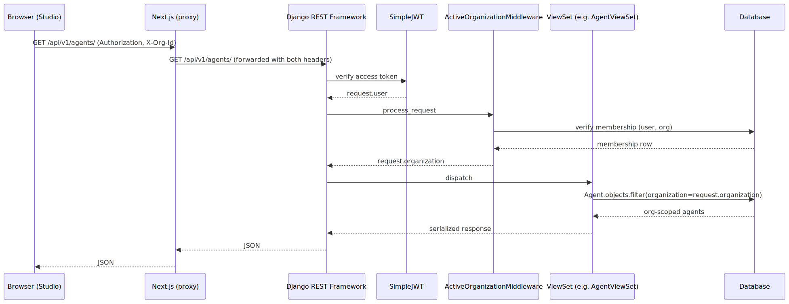

The flow has four important properties.

Firstly, **the tenant boundary is the organization, not the user**. A single user can belong to many organizations. They switch the active organization by writing a new value to a per-tab session-storage key, which is then sent as the `X-Org-Id` header.

Secondly, **the membership check is mandatory**. A request with a valid JWT but with an `X-Org-Id` header referring to an organization the user is not a member of gets an HTTP 403 from the middleware.

Thirdly, **the queryset filter is mandatory**. Every viewset filters its queryset by `request.organization` in `get_queryset()`. The only rows visible to the request are those that belong to the active organization.

Fourthly, **runtime-resource access is double-checked**. Helper functions such as `resolve_runtime_assistant_id` and `resolve_runtime_workflow_id` verify that the runtime identifier passed in by the client belongs to a row in the database scoped to the active organization, before forwarding the request to the voice runtime.

### 2.3.3 The workflow data model and compiler

The workflow data model has six node kinds: `start`, `conversation`, `tool`, `transfer_call`, `end_call`, and `api_request`. Edges connect nodes and may carry a branching condition. The condition can be a natural-language phrase ("user wants to schedule") or a structured liquid expression (`{{ intent == "schedule" }}`). Table 12 in Chapter 3 lists the full node taxonomy.

The compiler in `lib/workflows/runtime-compile.ts` translates this local data model into the payload expected by the voice runtime's workflow execution endpoint. The compiler is a pure function: given a `Workflow` data structure, it returns a serializable JSON payload. It enforces the following invariants.

- Nodes are identified by `name` (a string), not by `id`. The local data model uses `id` for stable cross-references in the editor; the compiler picks the human-readable label (or a safe slug derived from the label) as the runtime-visible name and discards the local `id`.
- The start node carries `isStart: true`. The compiler enforces this on the node selected as the entry point.
- Conversation nodes use `prompt` (not `systemPrompt`) for the per-node language-model instruction. The first spoken line is delivered via `messagePlan.firstMessage` rather than being prepended to the prompt.
- Variable extraction uses `variableExtractionPlan.output[]` with `{ title, type, description, enum? }` per variable.
- Tools available to a conversation node go in a top-level `toolIds: string[]` array; the runtime's language-model dialogue manager decides whether and when to invoke them. A standalone `tool` node uses `{ type: "tool", name, toolId }` and forces a single call.
- Global nodes (nodes that can be entered from anywhere in the workflow when an enter condition matches) carry `globalNodePlan: { enabled: true, enterCondition }`.
- Edges reference node `name`s through `from` and `to`. An edge's condition is encoded as an object: `{ type: "ai", prompt }` for natural-language conditions, or `{ type: "logic", liquid }` for structured ones. The compiler distinguishes them by the presence of `{{ ... }}` in the user-supplied condition.

I had two motivations for putting the compiler in TypeScript on the frontend rather than Python on the backend. Firstly, the studio user is editing the workflow in the browser. The compiler's output is needed immediately for the in-browser test call. Compiling on the frontend avoids a round-trip. Secondly, the workflow data model is most naturally expressed in the same language as the React components that render it. That keeps the surface area of the data model under control.

### 2.3.4 Tool registration and webhook authentication

The integration layer follows a tool-registration pattern that is intended to generalize across connectors. When an organization saves a Notion integration with a field map, the platform builds a set of five tool definitions (save, find, search, update, delete), each with a JSON schema reflecting the chosen field map. Each tool definition is registered with the voice runtime through its tool registration endpoint, with the tool's `serverUrl` pointing back to the platform's webhook endpoint at:

```
https://<public-host>/api/v1/webhooks/runtime/notion/<integration_id>/<kind>/
```

When the runtime invokes a tool during a call, it sends a POST request to this URL with the tool-call arguments in the body and a shared-secret header. The platform's webhook view performs the following sequence of steps.

1. **Authenticate the inbound webhook** by verifying the shared secret in the `X-Scale-Labs-Secret` header against `RUNTIME_SHARED_SECRET` in the environment. A request without a matching secret is rejected with HTTP 401.
2. **Resolve the integration** by looking up the `<integration_id>` path parameter in the `NotionIntegration` table.
3. **Decrypt the integration's stored credentials** using `decrypt_str` from `apps/studio/services/crypto.py`, which loads the Fernet key from `FIELD_ENCRYPTION_KEY` and decrypts the `token_ciphertext` field of the integration row.
4. **Dispatch to the kind-specific handler** in `apps/studio/services/notion_webhook_handlers.py` — `do_save`, `do_find`, `do_search`, `do_update`, or `do_delete` — which performs the underlying Notion API operation using the decrypted token.
5. **Format the result** into the structure the voice runtime expects (`{ results: [{ toolCallId, result }] }`) and return it to the runtime, which incorporates the result into the conversation.

This pattern has the property that **organization credentials never leave the platform**. The runtime knows only the webhook URL and the shared secret. The per-organization Notion token is read out of the database, used for the duration of one HTTP call, and never sent back to the runtime.

### 2.3.5 The voice runtime architecture

The Scale Labs voice runtime is the real-time conversational engine that bridges the customer's audio and the workflow defined in the studio. The runtime is architected as four cooperating components plus a state-machine orchestrator. Figure 3 summarizes the architecture.

**Figure 3. Voice runtime real-time conversation pipeline.**


The runtime processes a live conversation as follows.

**Audio in.** The telephony adapter receives the customer's audio over a SIP trunk, performs jitter buffering, echo cancellation, and packet-loss concealment, and forwards the resulting waveform to the streaming ASR. The ASR emits partial transcripts approximately every 200 milliseconds and a final transcript when the voice-activity detector (VAD) decides the customer's turn has ended.

**Dialogue turn.** When the customer's turn ends, the dialogue orchestrator constructs a prompt for the LLM dialogue manager that combines (a) the active workflow node's `prompt`, (b) the conversation transcript so far, (c) the variables extracted up to this point, (d) the tool catalog available at this node, and (e) the workflow's global prompt. The LLM is invoked through a streaming inference API; the orchestrator begins consuming the LLM's reply as soon as the first tokens are available.

**Tool calls.** If the LLM's reply contains a tool invocation (in the OpenAI-style function-call format that has become the de-facto standard for LLM tool use), the orchestrator pauses the response, posts to the platform's webhook endpoint at the URL registered for the tool, waits for the result (subject to a configurable timeout), incorporates the result back into the LLM's context, and continues generation. A tool call is invisible to the customer except for a small pause. The orchestrator may emit a verbal acknowledgment ("just a moment, let me check") if the tool is configured with a `messages.requestStart` template.

**Audio out.** The orchestrator forwards the LLM's textual reply to the neural TTS, which synthesizes audio in streaming mode and forwards it to the telephony adapter, which transmits it to the customer. The orchestrator maintains a small audio buffer to accommodate latency variations in the TTS pipeline.

**Barge-in.** While the agent is talking, the VAD continues to monitor the inbound audio stream. If the customer starts speaking, the orchestrator cancels the in-flight TTS, drains the telephony adapter's output buffer, and returns control to the ASR for the next customer turn. The result is a natural conversational rhythm in which the customer can interrupt the agent at any time.

**Voicemail.** On outbound calls, the orchestrator's first task is to determine whether the call has been answered by a human or by a voicemail system. The voicemail detector consumes the first few seconds of inbound audio and classifies it. If voicemail is detected, the orchestrator either ends the call or plays a templated message, depending on the workflow's configuration.

**Transfer.** A `transfer_call` node terminates the agent's leg of the call and bridges the customer to the destination configured on the node — a phone number for a human operator, another workflow, or an external IVR.

**End.** An `end_call` node closes the call gracefully, optionally with a final spoken line, and emits the call's metadata and event log to the platform's backend.

The voice runtime is the most complex subsystem of the platform from a real-time-systems perspective. The careful orchestration of streaming ASR, streaming LLM inference, streaming TTS, and barge-in handling is the engineering work that produces calls that feel natural to the customer. The runtime targets end-to-end latency under 700 milliseconds on the median turn.

### 2.3.6 Security mechanisms summary

The platform's security model is summarized in Table 14, near the end of Chapter 3, after each mechanism has been described in context. At the level of methodology, the relevant guarantees are the following: (a) tenant isolation enforced at the platform layer through middleware and queryset filtering, (b) third-party credentials never persisted in plaintext, (c) every inbound webhook authenticated against a shared secret, (d) every cross-tenant runtime-resource access blocked by a check that the runtime identifier belongs to the active organization, (e) transport encryption through HTTPS in production, and (f) JWTs rotated on every refresh.

## 2.4 Frameworks, libraries, and practical usage instructions

This section enumerates the frameworks and libraries used by the platform and the practical instructions for building and running it.

### 2.4.1 Frontend frameworks and libraries

**Table 10. Frontend dependencies.**

| Package | Version | Role |
|---------|---------|------|
| `next` | 16.2.6 | Application framework — App Router, routing, layouts, server components |
| `react`, `react-dom` | 19.2.4 | UI library |
| `typescript` | 5.x | Static typing of the entire frontend |
| `tailwindcss` | 4.x | Utility-first CSS |
| `@tailwindcss/postcss` | 4.x | PostCSS integration |
| `tw-animate-css` | 1.x | Animation utilities |
| `@radix-ui/react-*` | 1.x / 2.x | Headless accessibility primitives behind shadcn components |
| `shadcn` | 4.x | Component library copied into `components/ui/` |
| `lucide-react` | 1.x | Icon set |
| `@xyflow/react` | 12.x | Workflow canvas |
| `@tanstack/react-query` | 5.x | Data fetching and cache |
| `recharts` | 3.x | Charting for the metrics dashboard |
| `sonner` | 2.x | Toast notifications |
| `next-themes` | 0.4.x | Theme switching primitive |
| `class-variance-authority`, `clsx`, `tailwind-merge` | various | Component-variant utilities |
| `@notionhq/client` | 5.x | Notion API client used in design-time Next.js API routes |

### 2.4.2 Backend frameworks and libraries

**Table 11. Backend dependencies.**

| Package | Version | Role |
|---------|---------|------|
| `Django` | 5.x | Web framework — ORM, migrations, settings, admin |
| `djangorestframework` | 3.15+ | JSON API layer — viewsets, serializers, permissions |
| `djangorestframework-simplejwt` | 5.3+ | JSON Web Token authentication |
| `django-cors-headers` | 4.3+ | CORS handling for cross-origin frontend requests |
| `django-environ` | 0.11+ | Environment variable parsing |
| `PyMySQL` | 1.1+ | MySQL driver |
| `cryptography` | 42.0+ | Fernet symmetric encryption |
| `httpx` | 0.27+ | Outbound HTTP client |
| `notion-client` | 2.2+ | Notion API client used in webhook handlers |
| `pytest`, `pytest-django` | latest | Unit and integration tests |

### 2.4.3 Build and run instructions

The studio frontend is started in development with:

```
cd frontend
npm install
npm run dev
```

This runs Next.js in development mode on `http://localhost:3000` with webpack as the bundler. Environment variables are read from `frontend/.env.local`. The variable `NEXT_PUBLIC_API_BASE_URL` must point to either the local Next.js origin (through which `/api/v1/*` is proxied to the Django backend) or to a tunneled origin in the case where the voice runtime needs to reach the platform's webhooks from outside the development workstation.

The Django backend is started in development with:

```
cd backend
python -m venv .venv
.venv\Scripts\Activate.ps1
pip install -r requirements.txt
python manage.py migrate
python manage.py runserver 0.0.0.0:8000
```

This runs Django on `http://localhost:8000`. Environment variables are read from `backend/.env`. The required variables for full functionality are `RUNTIME_API_KEY`, `RUNTIME_PUBLIC_KEY`, `RUNTIME_SHARED_SECRET`, `RUNTIME_WEBHOOK_BASE` (or `DEV_PUBLIC_ORIGIN` as a fallback when running through the Next.js proxy), and `FIELD_ENCRYPTION_KEY`.

A demonstration workspace is provided for screenshot and pilot evaluation purposes. Sign in with the credentials `demo@acme.inc` / `AcmeDemo2026!` from the login page. The demonstration workspace contains ten agents, five published workflows, three Notion integrations, twelve phone numbers, and eighty-six call logs, populated entirely from a deterministic dataset so that screenshots and demonstrations remain stable across runs.


<div class="page-break"></div>

# CHAPTER 3. IMPLEMENTATION OF THE SCALE LABS PLATFORM

This chapter documents the implemented Scale Labs platform: the high-level system architecture, the database structure, the multi-tenant request flow as realized in code, the workflow studio and the workflow compiler, the voice runtime in operation, the integration layer, the operational dashboard, security and testing considerations, and the limitations of the current prototype together with the development roadmap. Screenshots taken from the running platform are embedded throughout the chapter at the points where each surface is described.


## 3.1 System architecture and database structure

### 3.1.1 High-level architecture

The Scale Labs platform consists of three principal deployable units: the **Next.js studio**, the **Django backend**, and the **voice runtime**. The three units communicate over a small number of well-defined interfaces. Figure 1 summarizes the architecture.

**Figure 1. Scale Labs system architecture.**


The studio is the primary user surface. It is a single-page application that consumes the backend's JSON API and uses the voice runtime's browser SDK directly for in-studio test calls, with the runtime's public key supplied by the backend so that the studio can establish a WebRTC session against the platform's runtime for test purposes.

The backend mediates every operation that requires server-side credentials, every operation that touches the multi-tenant data model, and every webhook callback from the voice runtime. The backend exposes a single versioned API namespace under `/api/v1/`, with viewsets for each principal entity and dedicated endpoints for the cross-cutting concerns of metrics, phone numbers, call logs, web-call configuration, outbound call placement, chat-mode invocation, and webhook handling.

The voice runtime is the real-time component that performs speech recognition, language-model reasoning, speech synthesis, and telephony. It is operated as a separate deployable unit, because its resource profile, latency requirements, and operating-system tuning differ from those of the control plane. The runtime exposes a REST API for resource management (assistants, workflows, tools, phone numbers, calls) and a webhook mechanism for tool callbacks during live calls. The runtime's media path — the audio between the platform's phone numbers and the customer — does not traverse the control plane at all. The control plane handles only the control-plane operations.

### 3.1.2 Database structure

The Django data model is divided between two Django apps: `apps.accounts` (user and organization model) and `apps.studio` (the entities that belong to the studio). The model is summarized in Table 8 and the entity-relationship diagram is shown in Figure 5.

**Table 8. Database entities and ownership.**

| Model | App | Key fields | Scope |
|-------|-----|------------|-------|
| `User` | accounts | `email`, `password`, `last_active_organization` | Global |
| `Organization` | accounts | `name`, `slug`, `kind` | Global (each row is one tenant) |
| `OrganizationMembership` | accounts | `user`, `organization`, `role` | Global (links users to organizations) |
| `Agent` | studio | `organization`, `name`, `config`, `runtime_assistant_id` | Organization-scoped |
| `Workflow` | studio | `organization`, `name`, `description`, `global_prompt`, `graph` (JSON), `runtime_workflow_id` | Organization-scoped |
| `NotionIntegration` | studio | `organization`, `label`, `database_id`, `data_source_id`, `field_mappings`, `token_ciphertext` (Fernet), `runtime_tools` | Organization-scoped |
| `Call` | studio | `organization`, `created_by`, `direction`, `runtime_call_id`, `status`, `customer_number`, `metadata` | Organization-scoped |
| `CallEvent` | studio | `call`, `event_type`, `payload` | Indirectly org-scoped via `call` |

**Figure 5. Database entity-relationship diagram.**


Every `studio` model carries a `ForeignKey` to `Organization`. Compound indexes on `(organization, updated_at)` and `(organization, created_at)` accelerate the organization-scoped list queries that drive the studio's primary views.

The `Workflow.graph` field is stored as a JSON blob containing the local workflow's nodes and edges. This keeps the relational schema simple: there is no separate `WorkflowNode` table, no separate `WorkflowEdge` table, and no risk of orphaned children when a workflow is deleted. The cost of this decision is that workflow content is not directly queryable through SQL. For instance, the platform cannot ask the database "how many workflows contain a tool node referencing integration X?" without scanning every workflow's JSON. For the prototype, I find this trade-off acceptable; in a later phase a normalized schema may be introduced if such queries become important.

The `NotionIntegration.token_ciphertext` field is a `BinaryField` that holds the Fernet ciphertext of the integration's Notion token. The plaintext is never persisted. The `runtime_tools` field is a JSON array of `{ kind, id, functionName, lastSyncedAt }` objects that records the platform-side state of each tool registered with the voice runtime.

The `Call` and `CallEvent` models mirror the voice runtime's call records at the metadata level, but the platform does not duplicate transcript content into the database. Transcripts and per-event detail are read from the runtime on demand when a user opens a call in the logs view. The database stores only the metadata needed to enforce organization-scoped access and to maintain references for outbound calls placed through the platform.

### 3.1.3 URL structure

The backend exposes a single versioned API namespace under `/api/v1/`. The principal endpoints are summarized in Table 9.

**Table 9. Principal API endpoints (versioned at `/api/v1/`).**

| Path | Method | Purpose |
|------|--------|---------|
| `/api/v1/auth/register/` | POST | Create a new user and personal organization |
| `/api/v1/auth/login/` | POST | Exchange email and password for a JWT pair |
| `/api/v1/auth/token/refresh/` | POST | Rotate refresh token, issue new access |
| `/api/v1/auth/me/` | GET | Current user and organizations |
| `/api/v1/auth/me/active-org/` | POST | Change the active organization |
| `/api/v1/agents/` | CRUD | Agent management |
| `/api/v1/agents/<id>/sync-runtime/` | POST | Push the agent's configuration to the voice runtime |
| `/api/v1/workflows/` | CRUD | Workflow management |
| `/api/v1/workflows/<id>/sync-runtime/` | POST | Push the compiled workflow to the voice runtime |
| `/api/v1/integrations/notion/` | CRUD | Notion integrations |
| `/api/v1/integrations/notion/<id>/sync-tools/` | POST/DELETE | Register or unregister Notion tools with the runtime |
| `/api/v1/calls/` | GET | Read calls owned by the organization |
| `/api/v1/calls/web-config/` | POST | Non-secret runtime identifiers for the browser SDK |
| `/api/v1/calls/outbound/` | POST | Place an outbound call through the runtime |
| `/api/v1/calls/chat/` | POST | Proxy a chat (text-mode) interaction to the runtime |
| `/api/v1/metrics/` | GET | Aggregated metrics dashboard |
| `/api/v1/phone-numbers/` | CRUD | Phone numbers assigned to the organization |
| `/api/v1/call-logs/` | GET | Org-scoped call log list pulled from the runtime |
| `/api/v1/call-logs/<runtime_call_id>/` | GET | Single call detail including transcript |
| `/api/v1/webhooks/runtime/events/` | POST | Optional runtime event hook |
| `/api/v1/webhooks/runtime/notion/<integration_id>/<kind>/` | POST | Tool webhook for the Notion connector |

The structure of these URLs reflects three design conventions. Firstly, the namespace is versioned: a future incompatible change to a payload shape can be expressed as `/api/v2/...` without breaking running clients. Secondly, REST resources (agents, workflows, integrations, calls) are exposed through DRF viewsets with the standard CRUD verbs, while cross-cutting operations (sync, outbound, web-config, metrics, logs) are exposed through dedicated views to keep their payloads precise. Thirdly, webhook endpoints are grouped under `/api/v1/webhooks/runtime/` and authenticated separately by shared secret rather than by user JWT, since the inbound caller is the voice runtime, not a human.

## 3.2 The studio: dashboard, agents, workflows, integrations, tools, and phone numbers

The studio is the primary user surface of the platform. It is organized into three sidebar groups — **Build**, **Connect**, and **Observe** — corresponding to the three phases of the operational life cycle: design, integrate, monitor. The grouping is intentionally simple. Each top-level item is a route in the Next.js App Router under `app/(app)/`, and the shared chrome of the studio (sidebar, header, breadcrumb, page padding, providers) is declared once in `app/(app)/layout.tsx` and applied to every page.

### 3.2.1 The dashboard

The dashboard is the landing page after sign-in. Its purpose is to summarize the active organization at a glance: which plan is in use, how many minutes have been spent in the current period, what the workspace looks like, how the recent calls have performed, and what needs immediate attention.

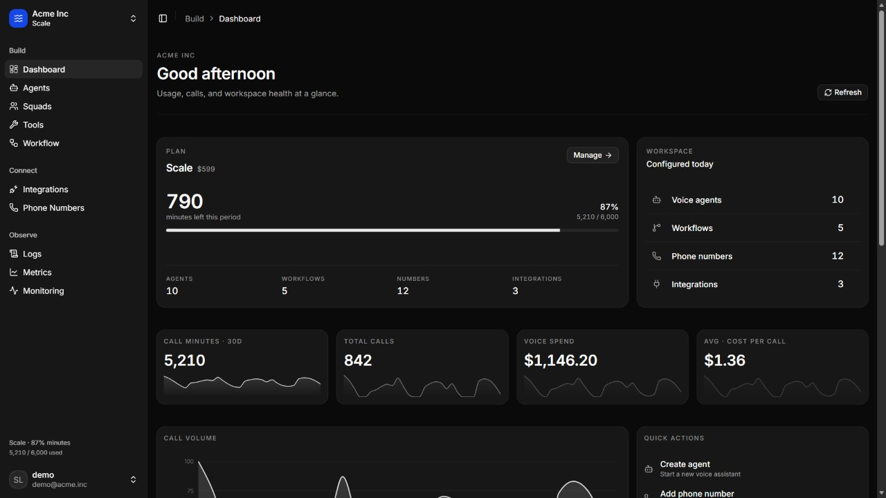

The dashboard is composed of six independent React components, each fetching its data through TanStack Query.

The **PlanUsageCard** shows the plan name, the remaining minutes for the current billing period, and the workspace counts for agents, workflows, phone numbers, and integrations. The **WorkspaceHealthCard** is a divider-separated row list that links to each managed entity. The **MetricKpiCard** is reused four times for total minutes, total calls, total spend, and average cost per call, each with a subtle sparkline below the number.

The **MetricsAreaChart** shows the call-volume trend over the last thirty days. The **QuickActionsCard** offers shortcuts to the most common operator actions — create agent, add phone number, view call logs, open metrics. The **NeedsAttentionCard** highlights unsuccessful calls in the recent period — calls that ended with a non-success reason such as "no answer", "busy", or "runtime error". The **RecentCallsCard** lists the most recent call records with type, duration, and cost.

Data for the dashboard is fetched in parallel. The metrics query hits `/api/v1/metrics/?days=30`, the recent-calls query hits `/api/v1/call-logs/?days=14&limit=10`, and the phone-numbers query hits `/api/v1/phone-numbers/`. All three queries share a cache and are warmed in the background by the `AppDataPrefetcher` component, so that returning to the dashboard from another page is instant. The same cache is reused by the dedicated metrics, logs, and phone-numbers pages further down the navigation tree, so that switching between pages does not re-trigger network requests for data that has already been loaded.

The dashboard layout adapts to the viewport. On a wide screen, the plan usage card occupies two-thirds of the top row with the workspace health card alongside it, the KPI cards fill a four-column row below them, and the call-volume chart, quick actions, and attention list share a three-column row below that. On a narrow screen, the layout collapses into a single column. The visual identity — minimal chrome, thin borders, dark background, uppercase eyebrow labels — is intentional and consistent across the entire studio. It is the result of a deliberate redesign pass that aligned the studio with the visual language of contemporary developer-focused SaaS products.

### 3.2.2 The agents page

The agents page lists the voice agents that belong to the active organization. Each agent has a name, a description, a primary language, a status (live or draft), a small set of tags, a count of minutes used in the current month, and a timestamp of the most recent call.

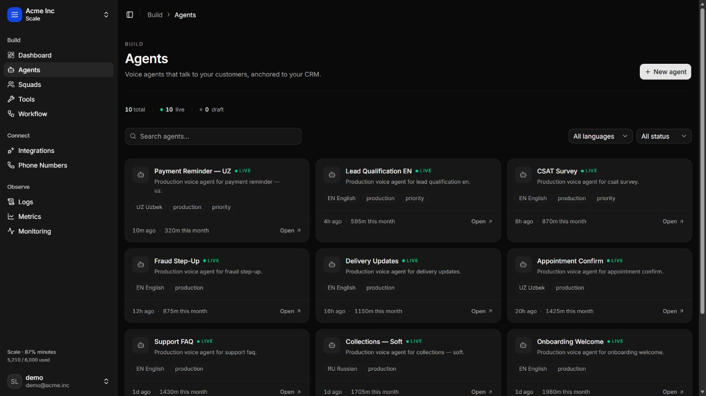

The page opens with the page header at the top — eyebrow "Build", title "Agents", and a one-line description, with the **New agent** button on the right. Immediately below the header, a small statistics strip shows the total number of agents in the workspace, the number that are live, and the number that are still in draft, each with a coloured status dot. The toolbar below the strip combines a text search field, a language filter (all / English / Russian / Uzbek), and a status filter (all / live / draft). The agent grid occupies the remainder of the page. Each agent card shows the agent's name, the status indicator (a green dot for live, a grey dot for draft), the agent's primary language, the integration kind (if the agent has a connected integration), a small set of tags, the most recent call timestamp, the minutes used in the current month, and a one-click link to open the agent's detail page.

When a new agent is created (through the **New agent** button), the studio opens a dialog that captures the agent's name, primary language, voice configuration, and starting prompt. On submission, the studio posts to `/api/v1/agents/`, which creates the agent row in the database, builds a runtime-ready assistant payload from the agent's configuration through `apps/studio/services/agent_assistant.py`, calls the voice runtime's `POST /assistant` endpoint, and stores the returned assistant identifier on the agent row's `runtime_assistant_id` field. Subsequent updates to the agent — change of name, system prompt, voice configuration, tool attachments — propagate to the runtime through `POST /api/v1/agents/<id>/sync-runtime/`, which compiles the agent again and pushes the result through `PATCH /assistant/<id>`. Deletion removes the row from the database and best-effort deletes the assistant from the runtime as well.

The agent card grid is responsive: three columns on a wide screen, two on a medium screen, one on a narrow screen. I designed the cards to be scannable rather than dense. The most important information — name, status, language, recent activity — is visible at a glance, and the deeper configuration (system prompt, voice settings, attached tools, integration field map) is opened in the agent detail page when the user clicks on a card. This division of detail follows the established design pattern of "list-then-detail" for SaaS workspaces, in which the list view optimizes for breadth and the detail view optimizes for depth.

### 3.2.3 The workflows page

The workflows page lists the workflows that belong to the active organization. Each workflow has a name, an optional description, a structural summary (number of nodes, number of edges), a synchronization state (published or draft), and a timestamp of the most recent update.

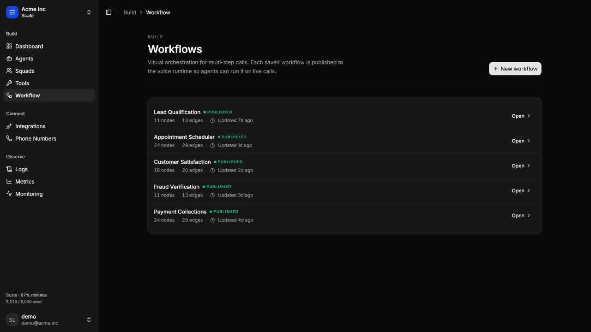

The page header is the same shape as on every other studio page — eyebrow "Build", title "Workflows", one-line description, **New workflow** button on the right. The workflows themselves are presented as a list of rows inside a single card, separated by thin dividers. Each row shows the workflow's name as a clickable link, the synchronization state as a small dot-prefixed label (green for "Published", grey for "Draft"), the structural counts ("12 nodes · 14 edges"), and the last-updated timestamp. A trash-can icon appears on hover for direct deletion, and a small "Open" button on the right of each row opens the workflow canvas.

Clicking on a workflow opens the workflow canvas, which is the most prominent feature of the studio. The canvas is built on `@xyflow/react`. It supports panning, zooming, dragging nodes to new positions on the canvas, and connecting two nodes by dragging from a connection handle on one node to a connection handle on the other.

A palette on the left provides drag-and-drop sources for new nodes of each of the six types. An inspector on the right binds to whichever node or edge is currently selected and exposes its editable properties. For a conversation node, this includes the first message, the system prompt, the variable extraction plan, and the attached tools; for a tool node, the tool selector; for a transfer-call node, the destination and an optional transfer message; for an end-call node, an optional closing line; and for an api-request node, the HTTP method, URL, headers, and body. The condition on an edge is also editable from the inspector: a plain-text condition is interpreted as a natural-language condition for the LLM dialogue manager, and a `{{ ... }}` expression is interpreted as a structured liquid condition evaluated against the variables extracted up to that point.

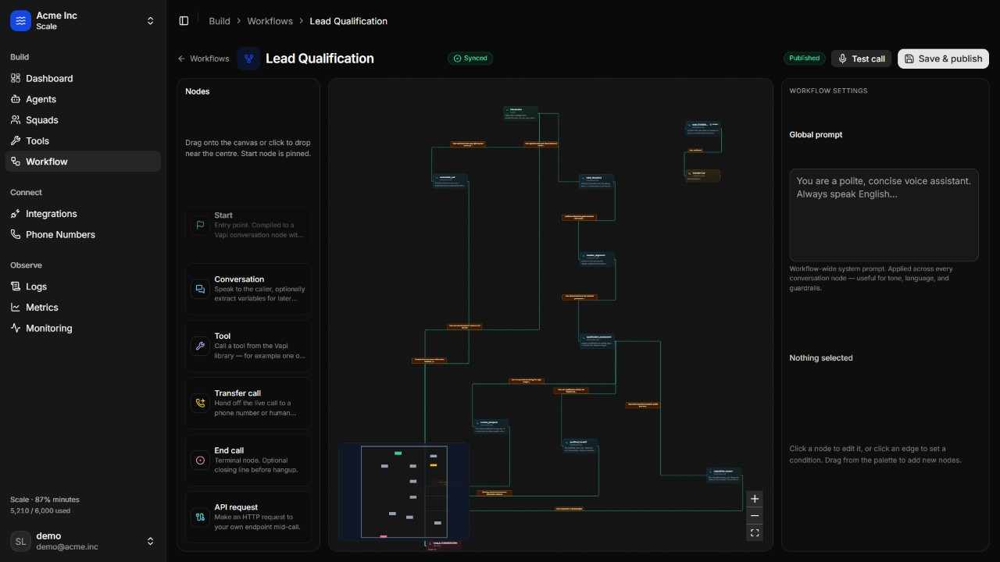

Saving a workflow triggers two actions in sequence. Firstly, the local workflow store persists the workflow's content to the backend through `PATCH /api/v1/workflows/<id>/`, which stores the graph in the `Workflow.graph` JSON field. Secondly, the workflow compiler (`lib/workflows/runtime-compile.ts`) converts the local graph into the runtime's expected payload, and the studio calls `POST /api/v1/workflows/<id>/sync-runtime/` with the compiled payload. The backend forwards the payload to the runtime's `POST /workflow` or `PATCH /workflow/<id>` endpoint, depending on whether the workflow has been published before, and stores the runtime workflow identifier on `Workflow.runtime_workflow_id`. From that point on, the workflow is published and available for inbound calls, outbound campaigns, and in-studio test calls.

The in-studio **test panel** uses the voice runtime's browser SDK to place a real call inside the browser, against the published workflow. The panel highlights the active step on the canvas in real time, which makes debugging the conversation flow substantially faster than relying only on transcripts after the fact. The test call is a real call against the real runtime. It does not consume billed minutes — browser test calls are free up to a per-workspace daily cap — but it exercises the full speech recognition, dialogue management, and synthesis pipeline.

The workflow data model is summarized in Table 12 below.

**Table 12. Workflow node taxonomy.**

| Kind | Role | Required editable fields |
|------|------|---------------------------|
| `start` | Entry point of the workflow | First message, system prompt, optional variable extraction |
| `conversation` | Spoken interaction with the customer | System prompt; optional first message, variable extraction, attached tools |
| `tool` | Forced invocation of a registered tool | Tool reference |
| `transfer_call` | Hand the live call to a destination | Destination phone number or workflow; optional transfer message |
| `end_call` | Close the call gracefully | Optional closing message |
| `api_request` | Make an HTTP request to an external endpoint | HTTP method, URL, headers, body |

**Figure 4. Workflow graph node taxonomy and compilation flow.**


### 3.2.4 The integrations page

The integrations page is the entry point for connecting external data systems to the workspace. The first connector I implemented in the platform is Notion. Additional connectors — HubSpot, Bitrix24, AmoCRM — appear in the "Coming soon" section of the page with a clear status indicator.

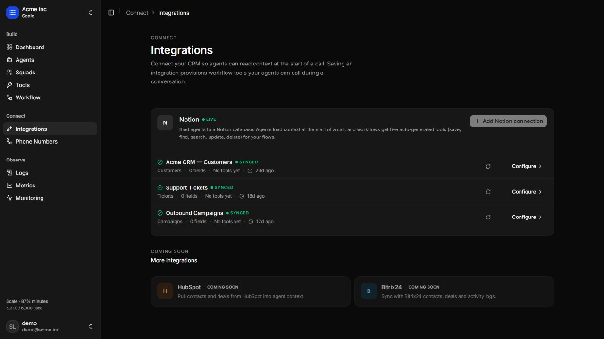

Connecting Notion requires three pieces of information from the user: a Notion internal-integration token (generated from the user's Notion account), a database identifier (selected from a list of databases the token has access to), and a field map that describes which Notion property corresponds to which conceptual field in the workspace. For instance, "Customer name" maps to a Title property, "Phone number" maps to a Phone property, "Status" maps to a Select property, and "Amount due" maps to a Number property. The connection wizard guides the user through these three steps. On completion, the platform encrypts the token using Fernet symmetric encryption, stores the field map, calls Notion's API to fetch the database's schema, and registers five tools (save, find, search, update, delete) with the voice runtime through a single `POST /api/v1/integrations/notion/<id>/sync-tools/` call. The five tools share the same field map, so any workflow that uses one of them automatically receives the correct schema for the connected database.

Resyncing an integration re-registers its tools with the runtime. This is necessary, for instance, when the field map changes, when the platform's webhook base URL changes (a common situation during pilot deployment), or when the runtime returns an unexpected error on a tool call. The resync action is reachable from a small icon button on each integration row in the list inside the Notion connector card.

### 3.2.5 The tools page

The tools page lists every function tool registered for the workspace. The page is organized into two sections: **system tools** — the four generic tools built into every standalone agent: query, transfer call, send SMS, voicemail — and **integration tools**, the five tools provisioned per Notion connection.

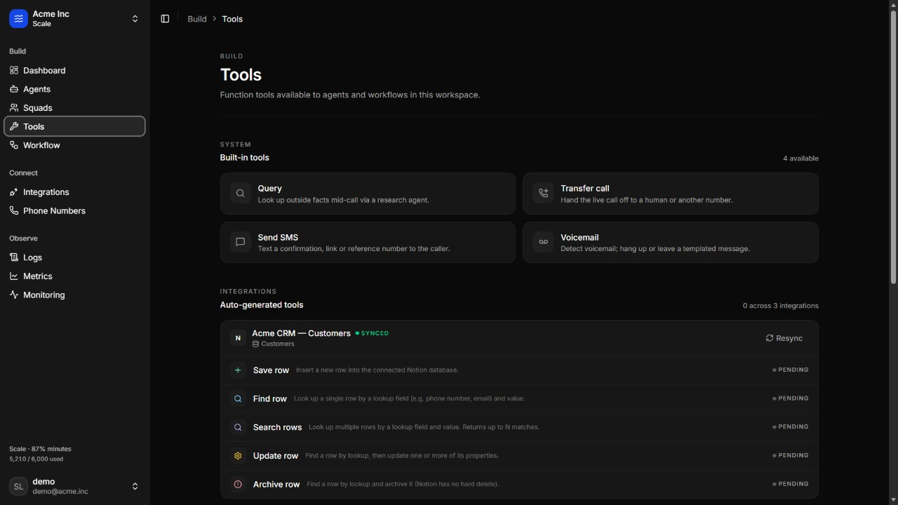

Clicking a tool opens a detail sheet that displays the tool's full JSON schema, its parameters, and, for integration tools, the field map it depends on. The detail sheet is the right place for technical inspection of a tool, and I have intentionally kept it out of the way of the main list so that the list itself remains scannable. The page redesign in late prototype development consolidated the previously dense tool tiles into clean row-style entries. Each row shows the tool's kind icon — with a kind-specific colour: emerald for save, sky for find, violet for search, amber for update, rose for delete — the tool's name, the tool's one-line description, and a live/pending status dot at the right edge of the row.

The Notion tool taxonomy is summarized in Table 13.

**Table 13. Notion tool taxonomy (per integration).**

| Kind | Role | Typical conversation use |
|------|------|---------------------------|
| `save` | Insert a new row into the connected Notion database | Logging a customer commitment, recording a new lead, writing a CSAT score |
| `find` | Look up a single record by unique key | Loading a customer's profile by phone number |
| `search` | Query multiple records by criteria | Finding overdue invoices for a customer |
| `update` | Modify an existing record | Updating a payment status, changing a lead stage |
| `delete` | Archive an existing record | Removing a stale lead, archiving a closed case |

### 3.2.6 The phone numbers page

The phone numbers page lists the telephone numbers assigned to the active organization. Each number has a provider, a name, an assignment (an agent or a workflow), and a status (active or blocked).

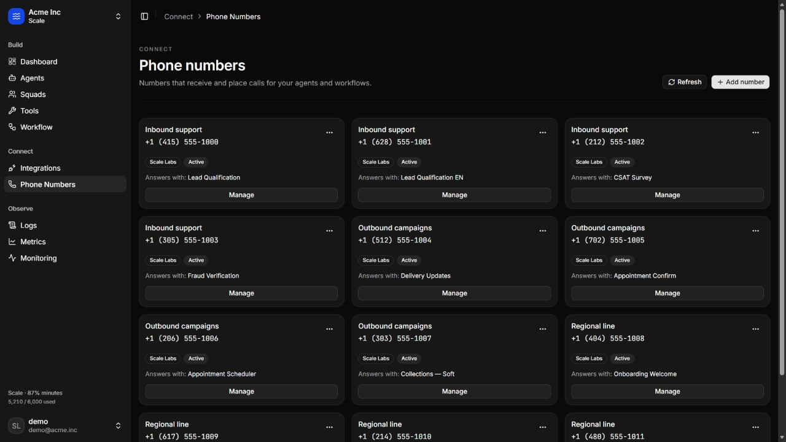

Adding a new number is performed through the **Add number** button, which opens a dialog with two flows: provisioning a new number from the platform's number inventory by area code, or connecting an existing number from a third-party carrier. After the number is created, it can be assigned to an agent or to a workflow. Inbound calls to the number will run through the assignment's configuration, and outbound calls placed through the platform's API can specify the number as the originating identity.

## 3.3 Operational visibility: logs, metrics, and monitoring

The "Observe" group of the studio navigation covers the operational visibility surfaces: logs, metrics, and monitoring. These are the surfaces through which an operations team observes the behaviour of its voice agents in production.

### 3.3.1 Call logs

The logs page lists the calls the organization has placed and received over a configurable time range — last seven or last thirty days — optionally filtered by a specific agent.

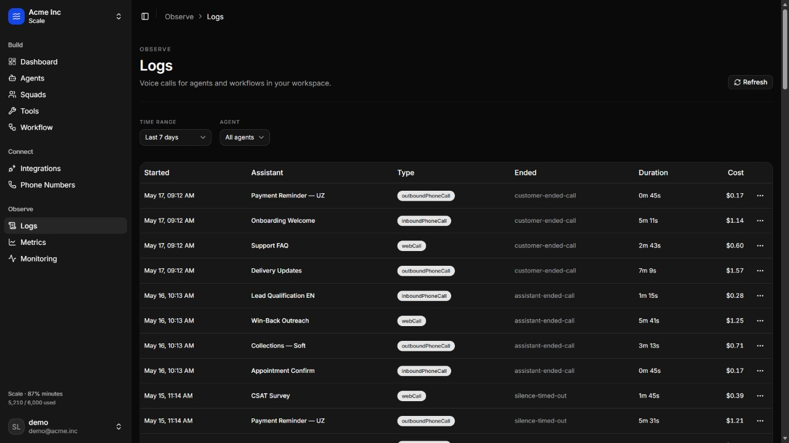

The logs table is wrapped in a single rounded card. Each row shows the start time, the agent or workflow that handled the call, the type of call (web, inbound, outbound, marked with a coloured uppercase label), the duration in minutes and seconds, and the cost in the workspace's billing currency. Clicking a row opens the call detail page.

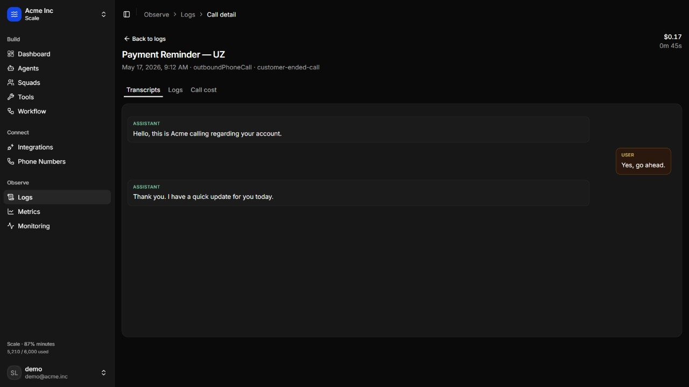

The call detail page shows three principal sections: the transcript (a turn-by-turn record of who said what), the event log (a structured record of the workflow nodes that were entered, the tools that were invoked, and the outcomes), and a cost breakdown. Transcripts and event logs are fetched on demand from the voice runtime rather than copied into the platform's database. This decision keeps the platform's storage requirements low and ensures that updates to the runtime's transcript model — for instance, the addition of speaker diarization, sentiment labels, or topic tags — are surfaced automatically without a migration on the platform side.

### 3.3.2 Metrics

The metrics page exposes aggregated metrics for the active organization over a configurable time range (last seven, thirty, or ninety days) with optional day or week grouping and optional filtering by a specific agent.

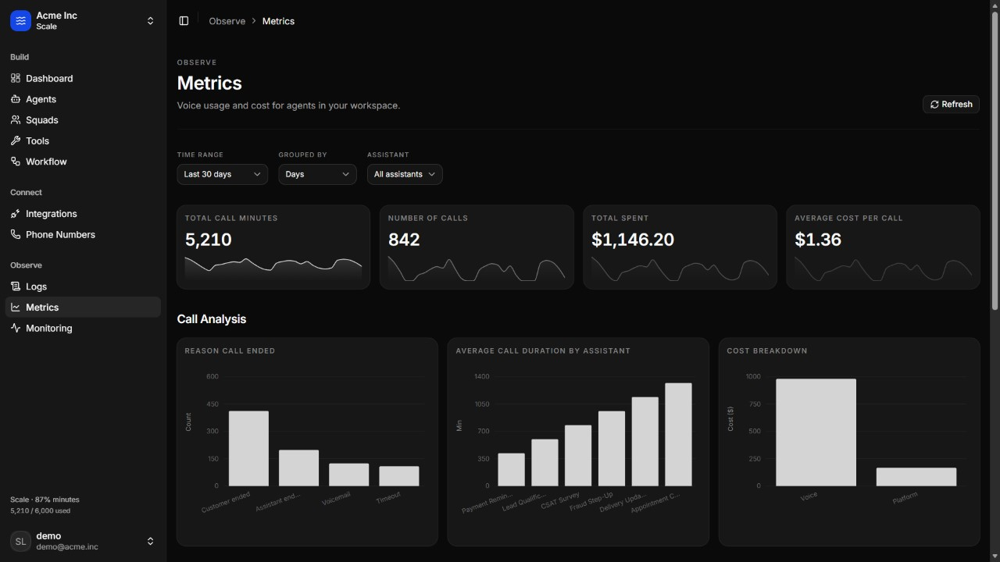

The KPI row at the top shows the four headline metrics: total call minutes, total number of calls, total voice spend, and average cost per call, each with a small sparkline showing the trend over the selected window. The first section below the KPI row contains three categorical charts: the reasons calls have ended (customer ended, assistant ended, voicemail, timeout), the average call duration by assistant, and the cost breakdown by category (voice runtime, platform). These charts use the same `MetricsStackedBarChart` component as the time-series charts further down the page, with the component's x-axis inference logic detecting the categorical x-field at runtime so the same component renders both shapes correctly.

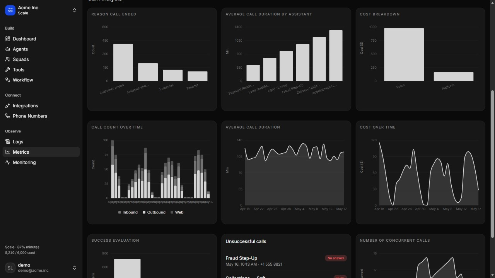

The lower sections of the metrics page contain four time-series charts and an "Unsuccessful calls" list. The time-series charts use day or week buckets according to the page's step selector. The unsuccessful-calls list highlights the calls that ended with an unsuccessful reason in the selected window, so that an operator can investigate them individually from a single starting point.

All metrics queries hit `/api/v1/metrics/?days=N&step=day|week&agent_id=<optional>`. The backend assembles the metrics by combining the voice runtime's analytics endpoint with the platform's own call records, caches the result for a short interval (sixty seconds by default) to keep the dashboard responsive, and serves it to the studio.

### 3.3.3 Squads and monitoring

The Squads page is reserved for future work on multi-agent coordination. A "squad" would be a set of agents with explicit handoff rules and a shared call flow, in the style of a small ensemble of specialized colleagues. The Monitoring page is reserved for future work on real-time operational health: live concurrency, error rates, queue depth, response-latency distributions, and quality alerts. Both pages currently show a placeholder with a clear "coming soon" indicator.

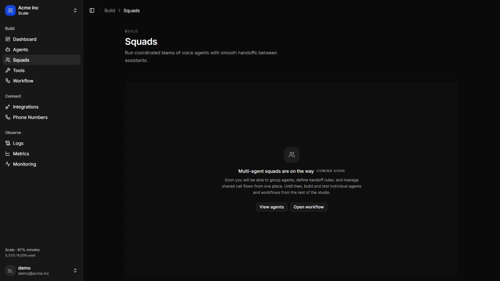

I chose to expose these pages as placeholders rather than hide them in the navigation for two reasons. Firstly, the studio's overall vision is easier to communicate to a jury or a pilot evaluator if the future surfaces are visible. Secondly, an operations user who learns the platform with the placeholders in view receives a smoother conceptual onboarding when the corresponding functionality is added, since the navigation structure does not change underneath them.

## 3.4 The voice runtime in operation

This section describes the voice runtime as it operates during a live conversation. The architecture was introduced in Section 2.3.5; here I describe the operational behaviour from the perspective of a single call, with attention to the details that determine whether the conversation feels natural to the customer.

### 3.4.1 Call setup

A call begins either as an inbound or an outbound event. For an inbound call, the telephony adapter receives the SIP invitation for an incoming call to one of the workspace's numbers, looks up the number's assignment (agent or workflow), and routes the call to the runtime's orchestrator with the corresponding configuration loaded. For an outbound call, the platform's backend places a `POST /api/v1/calls/outbound/` request with the customer number, the originating workspace number, and the agent or workflow to run. The platform forwards this to the runtime, which initiates a SIP invitation outbound to the customer's number and connects the answered call to the runtime's orchestrator.

In both cases, the orchestrator opens a session, loads the agent or workflow configuration, primes the LLM dialogue manager with the workflow's global prompt and the start node's local prompt, and enters the conversation loop.

### 3.4.2 The conversation loop

The conversation loop is a state machine that alternates between three principal states: agent speaking, customer speaking, and silence. The state machine is driven by the voice-activity detector, by the streaming ASR's final-transcript signal, and by the streaming TTS's playback-complete signal.

- **Agent speaking.** The orchestrator is forwarding TTS audio to the telephony adapter. The VAD is monitoring the inbound stream for the customer starting to speak. If it detects voice activity, the orchestrator transitions to **customer speaking** (barge-in), cancelling the in-flight TTS and draining the audio buffer.
- **Customer speaking.** The orchestrator is forwarding inbound audio to the streaming ASR and consuming partial transcripts. When the ASR signals end-of-turn (a final transcript, typically when the customer has paused for approximately 500–800 milliseconds), the orchestrator transitions to **agent speaking** with the next agent response.
- **Silence.** The orchestrator is idle, neither receiving nor sending audio. This is the brief state between turns. If silence persists beyond a configurable timeout (typically 8–12 seconds), the orchestrator either prompts the customer with a "hello, are you still there?" type intervention or, after a further timeout, ends the call.

The transition from customer speaking to agent speaking is the latency-critical path of the runtime. When the ASR emits the final transcript, the orchestrator must construct the LLM prompt, invoke the LLM, wait for the first tokens of the LLM reply, and forward those tokens to the TTS, which must synthesize the first audio chunk and forward it to the telephony adapter. The end-to-end target is sub-700-millisecond latency on the median turn. The runtime reaches this through (a) streaming inference from the LLM (consuming tokens as they are emitted rather than waiting for the full reply), (b) streaming synthesis from the TTS (synthesizing the first audio chunk while the LLM is still emitting tokens for the rest of the reply), and (c) a small jitter buffer on the telephony adapter to absorb micro-variations in TTS output rate.

### 3.4.3 Tool invocation during a conversation

A tool invocation is a structured request by the LLM dialogue manager to read or write external data during the conversation. The LLM emits a tool call in a structured format — the OpenAI-style function-call format that has become the de-facto standard. The orchestrator intercepts the tool call, posts to the platform's webhook endpoint at the URL registered for the tool, waits for the response, incorporates the response back into the LLM's context, and continues generation.

During the tool call, the orchestrator may optionally emit a verbal acknowledgement ("just a moment, let me check") if the tool is configured with a `messages.requestStart` template, and may emit a fall-back utterance if the tool times out. The default tool timeout is configurable per-tool but defaults to fifteen seconds. In practice, a Notion API call typically completes in under a second, so the timeout fires only when the platform or the Notion API is unreachable.

The platform's webhook receives the tool call, performs the underlying data operation through the Notion API (or the appropriate connector), and returns the result to the runtime in the structured format the runtime expects. The end-to-end round trip — runtime → platform → Notion → platform → runtime — is typically under 500 milliseconds for cached lookups and 800–1500 milliseconds for new writes.

### 3.4.4 Transfer and end

A `transfer_call` node terminates the agent's leg of the call and bridges the customer to the destination configured on the node. The destination is either a phone number (the call is transferred to a human operator on a separate SIP trunk), another workflow (the call is internally re-routed to a different workflow's start node, useful for routing between specialized workflows), or an external IVR (the call is bridged into an existing customer-service IVR for the parts of the conversation that the agent should not handle).

An `end_call` node closes the agent's leg of the call gracefully, optionally with a final spoken line. After the line completes, the orchestrator emits the call's metadata and event log to the platform's backend through the runtime's outbound webhook, and the platform records the call's final status.

### 3.4.5 Voicemail handling

On outbound calls, the orchestrator's first task is to determine whether the call has been answered by a human or by a voicemail system. The voicemail detector consumes the first few seconds of inbound audio and classifies it by combining several heuristics: the cadence and length of the initial utterance (voicemail greetings are typically longer than a human's "hello"), the presence of telephony-specific tones, and the LLM's interpretation of the first transcript chunk. If voicemail is detected, the orchestrator branches according to the workflow's configuration. It may end the call silently, play a templated message, or hang up after the greeting completes.

### 3.4.6 Quality and language support

The voice runtime supports English, Russian, and Uzbek at the language level. English is currently at the highest quality of the three. Russian is close behind, with continuing improvements to prosody and named-entity pronunciation. Uzbek is in active development, with the focus areas being accurate pronunciation of Latin and Cyrillic Uzbek word forms, regional accent coverage, and the natural prosody of polite-register Uzbek, which differs significantly from the casual register that most general-purpose TTS models produce.

The language of a call is selected by the agent or workflow that handles the call. The platform does not currently perform automatic language detection on inbound calls, although this is on the roadmap.

## 3.5 The integration layer: Notion as the first connector

The integration layer is the surface through which voice agents read and write the business data of the organizations they serve. The first connector I implemented in the platform is Notion, integrated end-to-end. This section describes the integration in detail; subsequent connectors are intended to follow the same pattern.

### 3.5.1 Connection setup

A Notion integration is created through the connection wizard accessible from the integrations page. The wizard collects three inputs from the user.

Firstly, the user supplies a **Notion internal-integration token**. Internal-integration tokens are created from the user's own Notion workspace and grant Scale Labs the ability to read and write the specific databases the token has been added to. The token is supplied to the wizard once, encrypted with the platform's Fernet key, and stored in the `NotionIntegration.token_ciphertext` field. The plaintext is never persisted.

Secondly, the user selects a **target database** from a list of databases the token has access to. The wizard fetches this list through Notion's `databases.list` endpoint, displays the database titles and last-edited timestamps, and stores the selected database identifier on the integration record.

Thirdly, the user defines a **field map** from conceptual fields used inside workflows — customer name, phone number, account status, amount due, due date, lead score, and so on — to Notion property identifiers and types. The wizard fetches the database's schema, presents the available properties, and stores the mapping on the integration record.

On completion, the platform fires `POST /api/v1/integrations/notion/<id>/sync-tools/`, which calls the tool-builder service to generate five tool definitions (save, find, search, update, delete) parameterized by the field map, and registers each tool with the voice runtime. The runtime stores each tool's identifier; the platform stores the runtime-side tool identifiers on the integration record's `runtime_tools` array.

### 3.5.2 Use during a conversation

When a workflow that uses one of the integration's tools is executed by the runtime, the LLM dialogue manager may decide to invoke the tool. The runtime issues a POST to the platform's webhook URL for the tool, with the tool call arguments in the body and the platform's shared secret in the `X-Scale-Labs-Secret` header. The platform's webhook view:

1. Verifies the shared secret. A missing or incorrect secret causes the request to be rejected with HTTP 401.
2. Looks up the integration by `<integration_id>` from the URL.
3. Decrypts the Notion token from `NotionIntegration.token_ciphertext`.
4. Dispatches to the kind-specific handler in `apps/studio/services/notion_webhook_handlers.py`.
5. Performs the Notion API operation: a `pages.create` for save, a `databases.query` for find or search, a `pages.update` for update, a `pages.update` with `archived: true` for delete.
6. Formats the result into `{ results: [{ toolCallId, result: <JSON string> }] }` and returns it to the runtime.

The runtime incorporates the result into the LLM's context and the dialogue manager continues the conversation, optionally referencing the result in its next utterance.

### 3.5.3 Failure handling

I anticipated several failure modes. A network error to Notion is retried twice with exponential back-off; if it still fails, the platform returns an error to the runtime, which can present a fallback utterance to the customer. A Notion API rate-limit response is similarly back-off-retried. A decryption failure, suggesting a configuration problem with the Fernet key, is logged and returned to the runtime as a hard error. A missing field map is treated as a configuration error and returned to the runtime as a hard error.

## 3.6 Voice quality, language support, and the Uzbek roadmap

Voice quality is, in my view, the single largest determinant of pilot success for an autonomous voice agent platform. A platform with weak voice quality produces calls that customers will find irritating or untrustworthy; a platform with strong voice quality fades into the background. The Scale Labs roadmap therefore prioritizes voice quality, particularly in Uzbek and Russian, as the most important pre-pilot work.

### 3.6.1 English voice quality

The platform's English voice quality is the strongest of the three supported languages, for both outbound campaigns and inbound support workflows. The TTS produces speech with natural prosody, correct named-entity pronunciation, and appropriate register variation between formal and casual contexts. The ASR reaches a word-error rate of approximately five percent on the telephony-quality English corpus I use for internal evaluation.

### 3.6.2 Russian voice quality

Russian voice quality is close behind English. The TTS produces speech that is intelligible and pleasant for most conversational contexts, with continuing improvements being made to formal-register prosody and to the pronunciation of named entities and place names. The ASR is at a strong level on clean telephony audio; performance degrades modestly on heavily accented Russian — regional accents and second-language speakers.

### 3.6.3 Uzbek voice quality

Uzbek voice quality is in active development. There are three areas I am working on. Firstly, the platform supports both Latin and Cyrillic Uzbek text input to the TTS and produces appropriate output in both writing systems. Secondly, the TTS prosody is being tuned for the polite-register Uzbek used in formal customer-service contexts, which differs from the casual register that general-purpose Uzbek TTS models typically produce. Thirdly, the ASR's handling of Uzbek regional accents, Russian loanwords, and code-switching — the natural Uzbek-Russian-English mixing that is common in urban Uzbek speech — is being improved through targeted training-data augmentation.

The Uzbek voice quality roadmap is the most significant pre-pilot work item for Uzbek customers. It is the single area in which my investment most directly determines whether the first pilots succeed.

## 3.7 Functional capabilities, testing, limitations, and future development

### 3.7.1 Functional capabilities of the implemented prototype

The functional capabilities of the implemented prototype are summarized in Table 15.

**Table 15. Functional capabilities of the implemented prototype.**

| Capability | State |
|------------|-------|
| Multi-organization workspace with email/password authentication | Implemented |
| Active-organization switching with `X-Org-Id` header | Implemented |
| Standalone voice agent creation and runtime sync | Implemented |
| Visual workflow editor with six node types and conditional edges | Implemented |
| Workflow compiler producing the voice runtime payload | Implemented |
| Workflow publish/unpublish through `sync-runtime` action | Implemented |
| In-studio browser test calls with active-step highlighting | Implemented |
| Notion integration end-to-end (connection, field map, tools, webhooks) | Implemented |
| Phone-number provisioning and assignment | Implemented |
| Inbound and outbound call execution through the voice runtime | Implemented |
| Call logs with transcript and event detail | Implemented |
| Metrics dashboard with KPIs and charts | Implemented |
| Real-time voice runtime (ASR + LLM dialogue + TTS + telephony) | Implemented |
| English voice quality | Strongest of the three languages |
| Russian voice quality | Close to English level |
| Uzbek voice quality | In active development |
| Demonstration presentation workspace with rich mock data | Implemented |
| Billing tiers visible in the UI (Pilot / Operations / Scale / Enterprise) | UI only |
| Payment-processor checkout and invoice generation | Not implemented (future) |
| Squad-style multi-agent orchestration | Not implemented (future) |
| Live monitoring console | Not implemented (future) |
| Additional CRM connectors (HubSpot, Bitrix24, AmoCRM) | Not implemented (future) |
| First-class SMS and email channels | Not implemented (future) |
| Audit log of administrative actions | Not implemented (future) |
| Role-based access control inside an organization | Not implemented (future) |

### 3.7.2 Billing tiers

The platform exposes four billing tiers in the studio's billing page, as summarized in Table 16. The tiers are visible in the UI, but checkout and limit enforcement are not yet connected to a payment processor.

**Table 16. Plan tiers exposed in the billing UI.**

| Tier | Monthly price | Minutes | Concurrent calls | Numbers | Workflows | Audience |
|------|---------------|---------|------------------|---------|-----------|----------|
| Pilot | Free (14-day trial) | 150 (hard cap) | 2 | 1 | 1 | Trial, diploma pilots |
| Operations | $149 / month | 1,500 | 10 | 3 | 3 | SMB, one production use case |
| Scale | $599 / month | 6,000 | 30 | 15 | Unlimited | Mid-market, multiple campaigns |
| Enterprise | Annual contract | Quoted | Reserved | Pooled | Unlimited | 24/7 ops, compliance industries |

### 3.7.3 Testing strategy

I test the platform at four levels.

**Unit tests** are written with `pytest` and `pytest-django` for the backend, primarily covering the workflow compiler, the multi-tenant query filters, the credential encryption helpers, the runtime tenancy resolvers, and the Notion webhook handler logic. The tests run against the SQLite engine I use during development. The frontend unit tests are limited in scope; the more important typing-level checks are performed by the strict TypeScript configuration.

**Type checking** is treated as a first-class form of testing. `npx tsc --noEmit` is run on the frontend before every commit. Since the workflow data model, the API client, and the Notion integration are all expressed in TypeScript with `strict` mode enabled, a wide class of integration errors — wrong field names, mismatched optional vs. required, accidental `any` casts — is caught before any code is run.

**Integration testing** is performed manually against the running platform, by signing in to the demonstration workspace, creating an agent, designing a workflow, attaching a Notion integration, placing a test call, and inspecting the resulting transcript in the logs page. The acceptance criterion for any non-trivial change is that this end-to-end flow continues to work. The project's internal intent document refers to this as "protecting the demo path".

**Voice runtime evaluation** is performed against a small internal corpus of test conversations representative of the target use cases — payment reminders in English and Russian, lead qualification in English, delivery confirmation in Uzbek. Each evaluation measures end-to-end latency, conversation completion rate, customer-rated naturalness on a small panel, and word-error rate of the ASR.

### 3.7.4 Limitations of the current prototype

The current prototype has the following limitations.

**Connector library.** Notion is the only fully implemented integration. HubSpot, Bitrix24, AmoCRM, and generic-API connectors are listed in the roadmap. The tool-based pattern that Notion follows is intended to generalize, but each new connector still requires development and testing work.

**Payment enforcement.** Billing plans are visible in the studio's billing page, but checkout is not connected to a payment processor and per-plan limits are not enforced. A future production deployment would require integration with a payment processor — Stripe for international customers, a regionally appropriate processor for Uzbek customers — and middleware that enforces plan limits on phone-number creation, workflow publishing, integration count, and outbound call placement.

**Audit log.** Administrative actions are not logged in a structured, queryable form. Compliance-sensitive deployments would require an audit log of who changed what and when.

**Rate limiting at the platform layer.** The platform relies on the voice runtime's own rate limits and on the organization-scoped queryset filtering. Application-layer rate limiting, for instance via `django-ratelimit`, would be added before a future production deployment.

**Fine-grained authorization.** All members of an organization currently have the same effective permissions. A role-and-permission system would be required for organizations that need separate administrative and analyst roles, particularly in compliance-sensitive industries.

**Outbound campaigns UI.** The platform has API support for placing outbound calls in bulk, but the studio's coverage of that capability is currently thin. A campaigns UI — list of customers, schedule, retry policy, results dashboard — would make outbound use cases substantially easier to operate.

**Squad-style multi-agent orchestration.** Coordinated handoffs between specialized agents within one call session — for instance a triage agent transferring to a billing specialist agent and then to a retention agent — are not yet implemented.

**Live monitoring console.** Real-time operational health is not surfaced. Concurrency, error rates, response-latency distributions, and quality alerts would belong on a dedicated monitoring page.

### 3.7.5 Future development roadmap

The platform's roadmap, prioritized in order of importance for pilot deployment, is summarized below.

1. **Uzbek voice quality.** The most important pre-pilot work for Uzbek customers. Until Uzbek voice quality reaches a level comparable to English, Uzbek pilots are constrained to English-speaking customer segments.
2. **Two or three additional CRM connectors.** AmoCRM and Bitrix24 for the Uzbek market, and HubSpot for the international market, would significantly broaden the set of pilot conversations the platform can host. The same tool-based pattern as the Notion connector is reused for each.
3. **Outbound campaigns UI.** In my view, the single largest pre-pilot improvement to the studio for outbound use cases.
4. **Billing enforcement.** Integration with a payment processor and enforcement of plan limits.
5. **Squad-style multi-agent orchestration.** Coordinated handoffs between specialized agents within one call session.
6. **Live monitoring console.** Real-time operational health: concurrency, error rates, response-latency distributions, quality alerts.
7. **Audit log and role-based access control.** Compliance-sensitive deployment readiness.
8. **Server-authoritative workflow drafts.** Move the editing draft surface from the browser's local cache to the backend, so that an operations user can resume editing on a different machine without losing local state.

## 3.8 Security mechanisms summary

I described the platform's security model in context throughout this chapter; for reference, it is summarized in Table 14.

**Table 14. Security mechanisms summary.**

| Concern | Mechanism |
|---------|-----------|
| User authentication | Email + password, JSON Web Tokens with rotating refresh |
| Tenant isolation | `X-Org-Id` header, `ActiveOrganizationMiddleware`, queryset filtering |
| Runtime resource access | Verify the runtime identifier belongs to the active organization before forwarding |
| Third-party credential storage | Fernet symmetric encryption with key in environment variable |
| Webhook authentication | Shared-secret header verified on every inbound webhook |
| Transport security | HTTPS in production; HTTPS tunnel in development |
| CORS | Allow-list of origins in `CORS_ALLOWED_ORIGINS`; `X-Org-Id` permitted via `CORS_ALLOW_HEADERS` |
| CSRF | Not applicable to JWT-authenticated JSON APIs |
| LLM prompt injection | Workflow's global prompt and per-node prompt constrain the LLM's behaviour; tools are explicitly listed per node |
| Transcript privacy | Transcripts pulled on demand from the runtime and not duplicated in the platform's database; access controlled by org-scoped permission |

<div class="page-break"></div>

# CONCLUSION

This thesis has described the design and implementation of **Scale Labs**, a working prototype of an AI voice agent platform for automating repetitive business customer-communication tasks. The work was motivated by a practical observation about service organizations in Uzbekistan and similar emerging markets: a large share of customer telephony is rule-bound, follows a small number of stable patterns, and consumes a disproportionate amount of operator capacity at a cost that scales linearly with customer-base growth. The thesis treats this class of work as configurable software — workflows authored by operations teams in a visual studio, executed by a real-time voice runtime that performs speech recognition, language-model dialogue management, and speech synthesis over a telephony adapter, and integrated with the organization's existing data sources through a tool-based webhook pattern.

The introduction defined the object, subject, aim, tasks, and methods of the work. Chapter 1 analysed the relevance of autonomous customer voice communication in Uzbekistan, presented an indicative cost composition of a twenty-four-hour call-centre seat in soum, surveyed the national digital-transformation context, and identified five sectors with the largest expected impact: banking and microfinance, telecommunications, e-commerce and marketplaces, logistics and last-mile delivery, and education and recruitment. It then reviewed the theoretical foundations of conversational AI systems, surveyed the existing categories of customer-communication automation — legacy IVR, generic chatbot platforms, contemporary voice-AI platforms studied as design references, bespoke vendor projects, and internal call-centre tools — and stated the engineering problem as eight numbered properties (P1 through P8).

Chapter 2 explained the technology choices and compared each with alternatives. I chose Next.js 16 with React 19 for the studio frontend, Django 5 with Django REST Framework for the backend, MySQL for production and SQLite for development, JSON Web Tokens with rotating refresh and an `X-Org-Id` header for multi-tenant authentication, Fernet symmetric encryption for third-party credentials, `@xyflow/react` for the workflow graph editor, TanStack Query for the data-fetching layer, and the Vapi AI voice runtime for streaming automatic speech recognition, LLM-driven dialogue management with tool use, neural text-to-speech, and a SIP telephony adapter. The chapter also described the development environment, the indicative server requirements, the methodology (prototype-driven iteration with strong typing and short feedback loops), the multi-tenant request flow, the workflow data model and compiler, the tool-registration pattern and webhook authentication, and the voice runtime's real-time conversation pipeline.

Chapter 3 documented the implemented system: the system architecture, the database structure and entity-relationship diagram, the URL structure, the studio across six pages (dashboard, agents, workflows, integrations, tools, phone numbers), the workflow engine in operation, the operational visibility surfaces (logs, metrics, squads placeholder), the voice runtime's behaviour during a live conversation, the Notion integration as the first connector, the voice quality status and Uzbek roadmap, the functional capabilities of the implemented prototype, the billing tiers, the testing strategy, the limitations, and the future development roadmap. Each page of the studio is documented with a screenshot taken from the running platform.

**What was built.** A workspace user can create an agent, design a workflow, attach a Notion integration, assign a phone number, place a test call from the browser, see the workflow's active step on the canvas, hear the conversation conclude, and review the transcript and metrics in the dashboard — all without leaving the studio. Each of these steps exercises a distinct subsystem of the platform: authentication, multi-tenant filtering, agent runtime sync, workflow compilation and publish, tool registration, webhook authentication, browser-SDK invocation, call-log retrieval, and metrics aggregation. Scale Labs follows the workflow-first authoring model established by Vapi AI and Retell AI. The engineering work here is the multi-tenant studio, the workflow compiler that targets Vapi's payload format, the voice runtime integration, the Notion connector with tool-based webhooks, and the operational dashboard.

**What was not built.** Several items described in the roadmap remain unimplemented and are listed here for honest scope-keeping:

- Squad-style multi-agent orchestration (the Squads page is a placeholder).
- The live Monitoring console (the Monitoring page is a placeholder).
- The Bitrix24 and HubSpot connectors (Notion is the only fully implemented integration).
- Uzbek voice integration with Yandex Cloud. Uzbek voice quality is in active development and is not yet at the level required for Uzbek-language pilots.
- Payment-processor checkout with per-plan limit enforcement.
- Audit logging and role-based access control inside an organization.
- An outbound campaigns UI.
- Application-layer rate limiting.

**Required further testing.** The prototype has been exercised through the demonstration workspace and through internal end-to-end runs. It has not been deployed against real customer telephony volumes, real CRM data, or the latency and reliability conditions of a live operations team. Further pilot testing is required before any claims can be made about throughput, reliability, voice quality at scale, or compliance posture. The platform currently supports a small number of concurrent users; scaling is future work.

For Uzbek pilots, the most immediate next steps are improvement of Uzbek voice quality — the single largest pre-pilot work item — implementation of one or two additional CRM connectors that match the local market (AmoCRM and Bitrix24 in particular), and construction of an outbound campaigns UI to make payment-reminder, lead-qualification, and delivery-confirmation campaigns easier to operate. For wider use, additional connectors targeted at the international SaaS ecosystem (HubSpot in particular) and payment-processor integration with per-plan limit enforcement would follow.

In conclusion, this thesis defends a working prototype that demonstrates the proposed architecture. It is a starting point for further development rather than a finished product, and the next steps are the items listed above and in Section 3.7.5.

<div class="page-break"></div>

# REFERENCES

1. Government of the Republic of Uzbekistan. *Development Strategy of New Uzbekistan for 2022–2030*. Tashkent, 2022.
2. Government of the Republic of Uzbekistan. *Digital Uzbekistan-2030 Strategy*. Tashkent, 2020.
3. Ministry of Digital Technologies of the Republic of Uzbekistan. *Annual Report on the Digital Economy*. Tashkent, 2024.
4. World Bank Group. *Digital Economy in Uzbekistan: Country Diagnostic*. Washington, DC: World Bank, 2023.
5. International Telecommunication Union. *Measuring Digital Development: Facts and Figures*. ITU Publications, Geneva, 2024.
6. International Telecommunication Union. *ITU-T Recommendation G.114: One-way Transmission Time*. Geneva, 2003.
7. Vaswani, A., Shazeer, N., Parmar, N., Uszkoreit, J., Jones, L., Gomez, A. N., Kaiser, L., Polosukhin, I. *Attention Is All You Need*. Advances in Neural Information Processing Systems, vol. 30, 2017.
8. Brown, T., Mann, B., Ryder, N., et al. *Language Models are Few-Shot Learners*. Advances in Neural Information Processing Systems, vol. 33, 2020.
9. Radford, A., Kim, J. W., Xu, T., et al. *Robust Speech Recognition via Large-Scale Weak Supervision*. OpenAI Research, 2022.
10. Ouyang, L., Wu, J., Jiang, X., et al. *Training language models to follow instructions with human feedback*. NeurIPS, 2022.
11. Schick, T., Dwivedi-Yu, J., Dessì, R., et al. *Toolformer: Language Models Can Teach Themselves to Use Tools*. NeurIPS, 2023.
12. Yao, S., Zhao, J., Yu, D., Du, N., Shafran, I., Narasimhan, K., Cao, Y. *ReAct: Synergizing Reasoning and Acting in Language Models*. ICLR, 2023.
13. Sutskever, I., Vinyals, O., Le, Q. V. *Sequence to Sequence Learning with Neural Networks*. NeurIPS, 2014.
14. Hochreiter, S., Schmidhuber, J. *Long Short-Term Memory*. Neural Computation, vol. 9, 1997.
15. Russell, S., Norvig, P. *Artificial Intelligence: A Modern Approach*. Pearson, 4th edition, 2021.
16. Sutton, R., Barto, A. *Reinforcement Learning: An Introduction*. MIT Press, 2nd edition, 2018.
17. Goodfellow, I., Bengio, Y., Courville, A. *Deep Learning*. MIT Press, 2016.
18. Kleppmann, M. *Designing Data-Intensive Applications*. O'Reilly Media, 2017.
19. Fielding, R. T. *Architectural Styles and the Design of Network-based Software Architectures*. PhD thesis, University of California, Irvine, 2000.
20. Newman, S. *Building Microservices*. O'Reilly Media, 2nd edition, 2021.
21. Sommerville, I. *Software Engineering*. Pearson, 10th edition, 2015.
22. Pressman, R. S., Maxim, B. R. *Software Engineering: A Practitioner's Approach*. McGraw-Hill, 9th edition, 2019.
23. Fowler, M. *Refactoring: Improving the Design of Existing Code*. Addison-Wesley, 2nd edition, 2018.
24. Beck, K. *Test-Driven Development: By Example*. Addison-Wesley, 2002.
25. Booch, G., Rumbaugh, J., Jacobson, I. *The Unified Modeling Language User Guide*. Addison-Wesley, 2nd edition, 2005.
26. Hopcroft, J. E., Motwani, R., Ullman, J. D. *Introduction to Automata Theory, Languages, and Computation*. Pearson, 3rd edition, 2006.
27. Date, C. J. *An Introduction to Database Systems*. Addison-Wesley, 8th edition, 2003.
28. Garcia-Molina, H., Ullman, J. D., Widom, J. *Database Systems: The Complete Book*. Pearson, 2nd edition, 2008.
29. Jones, M., Bradley, J., Sakimura, N. *RFC 7519: JSON Web Token (JWT)*. Internet Engineering Task Force, 2015.
30. Fette, I., Melnikov, A. *RFC 6455: The WebSocket Protocol*. Internet Engineering Task Force, 2011.
31. Rosenberg, J., Schulzrinne, H., Camarillo, G., et al. *RFC 3261: SIP — Session Initiation Protocol*. Internet Engineering Task Force, 2002.
32. NIST. *FIPS 197: Advanced Encryption Standard (AES)*. National Institute of Standards and Technology, 2001.
33. Django Software Foundation. *Django 5 Documentation*. https://docs.djangoproject.com/, retrieved 2026.
34. Django REST Framework. *Official Documentation*. https://www.django-rest-framework.org/, retrieved 2026.
35. Vercel Inc. *Next.js 16 Documentation*. https://nextjs.org/docs, retrieved 2026.
36. Meta Platforms. *React 19 Documentation*. https://react.dev/, retrieved 2026.
37. Tailwind Labs. *Tailwind CSS v4 Documentation*. https://tailwindcss.com/docs, retrieved 2026.
38. shadcn. *shadcn/ui Component Library*. https://ui.shadcn.com/, retrieved 2026.
39. xyflow GmbH. *@xyflow/react (React Flow) Documentation*. https://reactflow.dev/, retrieved 2026.
40. TanStack. *TanStack Query v5 Documentation*. https://tanstack.com/query/, retrieved 2026.
41. Notion Labs Inc. *Notion API Reference*. https://developers.notion.com/, retrieved 2026.
42. McKinsey & Company. *The State of Customer Care*. Industry report, 2023.
43. Gartner Inc. *Magic Quadrant for Contact Center as a Service*. Industry report, 2024.
44. Statista. *Voice AI market size and forecast, 2024–2030*. Industry report, 2024.
45. Deloitte Insights. *Global Contact Center Survey*. Industry report, 2024.

<div class="page-break"></div>

# APPLICATIONS

## Application A. Source code structure

The Scale Labs source code is organized into two top-level directories: `frontend/` (the Next.js studio) and `backend/` (the Django backend, including the voice-runtime control-plane interfaces). The principal directories and files are listed below.

```
Scale-Labs/
├── frontend/
│   ├── package.json
│   ├── next.config.ts
│   ├── tsconfig.json
│   ├── src/
│   │   ├── app/
│   │   │   ├── (app)/                  # Authenticated studio routes
│   │   │   │   ├── layout.tsx          # Shared chrome and providers
│   │   │   │   ├── dashboard/
│   │   │   │   ├── agents/
│   │   │   │   ├── workflow/
│   │   │   │   ├── integrations/
│   │   │   │   ├── tools/
│   │   │   │   ├── phone-numbers/
│   │   │   │   ├── logs/
│   │   │   │   ├── metrics/
│   │   │   │   ├── billing/
│   │   │   │   ├── squads/
│   │   │   │   └── monitoring/
│   │   │   ├── (auth)/                 # Sign-in and sign-up routes
│   │   │   ├── api/v1/[...path]/       # Reverse proxy to Django
│   │   │   ├── layout.tsx              # Root layout
│   │   │   └── globals.css             # Tailwind v4 imports and theme tokens
│   │   ├── components/
│   │   │   ├── ui/                     # shadcn primitives (button, card, table, ...)
│   │   │   ├── agents/
│   │   │   ├── workflows/
│   │   │   ├── integrations/
│   │   │   ├── tools/
│   │   │   ├── dashboard/
│   │   │   ├── metrics/
│   │   │   ├── billing/
│   │   │   └── page-header.tsx
│   │   ├── lib/
│   │   │   ├── api/                    # Fetch client, env, token storage
│   │   │   ├── workflows/              # Workflow store, types, compiler, templates
│   │   │   ├── agents/                 # Agent store, hydration bridge, types
│   │   │   ├── integrations/notion/    # Notion integration helpers
│   │   │   ├── calls/                  # Call-log API
│   │   │   ├── metrics/                # Metrics API
│   │   │   ├── phone-numbers/          # Phone-number API
│   │   │   ├── billing/                # Workspace billing snapshot
│   │   │   ├── demo/                   # Presentation workspace dataset
│   │   │   ├── query/                  # TanStack Query setup and prefetch
│   │   │   └── runtime/                # Browser-side voice runtime helpers
│   │   ├── contexts/
│   │   │   └── auth-context.tsx
│   │   └── hooks/
│   └── public/
└── backend/
    ├── requirements.txt
    ├── manage.py
    ├── config/
    │   ├── settings/{base,dev,prod}.py
    │   ├── urls.py
    │   ├── runtime_webhook.py
    │   └── asgi.py / wsgi.py
    ├── apps/
    │   ├── accounts/                   # User, Organization, Membership
    │   │   ├── models.py
    │   │   ├── views.py
    │   │   ├── serializers.py
    │   │   ├── urls.py
    │   │   ├── middleware.py
    │   │   └── migrations/
    │   └── studio/                     # Agent, Workflow, Integration, Call, CallEvent
    │       ├── models.py
    │       ├── views.py
    │       ├── serializers.py
    │       ├── permissions.py
    │       ├── mixins.py
    │       ├── middleware.py / middleware/
    │       ├── services/
    │       │   ├── runtime.py
    │       │   ├── runtime_tenancy.py
    │       │   ├── runtime_call_access.py
    │       │   ├── runtime_call_normalize.py
    │       │   ├── runtime_phone_access.py
    │       │   ├── runtime_phone_normalize.py
    │       │   ├── runtime_metrics.py
    │       │   ├── runtime_webhook_auth.py
    │       │   ├── agent_assistant.py
    │       │   ├── crypto.py
    │       │   ├── notion_http.py
    │       │   ├── notion_tool_builder.py
    │       │   └── notion_webhook_handlers.py
    │       ├── urls.py
    │       ├── tests/
    │       └── migrations/
    └── docs/
        └── TENANCY_AND_RUNTIME.md
```

## Application B. Build and run commands

The development environment is started with the following commands.

```
# Frontend (Next.js studio)
cd frontend
npm install
npm run dev          # http://localhost:3000

# Backend (Django REST Framework)
cd backend
python -m venv .venv
.venv\Scripts\Activate.ps1
pip install -r requirements.txt
python manage.py migrate
python manage.py runserver 0.0.0.0:8000
```

A demonstration workspace can be entered from the sign-in page by clicking **Open Acme demo workspace** or by signing in with the credentials `demo@acme.inc` / `AcmeDemo2026!`. The demonstration workspace contains ten agents, five published workflows, three Notion integrations, twelve phone numbers, and eighty-six call logs, and is populated entirely from a deterministic dataset so that screenshots and demonstrations remain stable across runs.

## Application C. Demonstration workspace data

The demonstration workspace is built from the dataset declared in `frontend/src/lib/demo/acme-presentation-data.ts`. The agents are named after realistic use cases — Payment Reminder UZ, Lead Qualification EN, CSAT Survey, Fraud Step-Up, Delivery Updates, Appointment Confirm, Support FAQ, Collections Soft, Onboarding Welcome, Win-Back Outreach. The workflows are derived from the templates in `frontend/src/lib/workflows/templates/` (lead qualification, appointment scheduler, customer satisfaction). The metrics dataset contains thirty days of synthetic call-volume, minute-usage, and cost data with sparkline shapes designed to produce visually clean charts. The dataset is reset on every demonstration sign-in so that the demonstration workspace is reproducible.

## Application D. Sample workflow JSON

A representative compiled workflow payload (lead qualification) has the following shape:

```json
{
  "name": "Lead Qualification",
  "globalPrompt": "You are a courteous lead qualification agent.",
  "nodes": [
    {
      "type": "conversation",
      "name": "start",
      "isStart": true,
      "prompt": "Greet the caller and confirm interest.",
      "messagePlan": { "firstMessage": "Hi, this is Acme calling about your enquiry." },
      "variableExtractionPlan": {
        "output": [
          { "title": "interested", "type": "boolean", "description": "Whether the caller confirmed interest." }
        ]
      }
    },
    {
      "type": "conversation",
      "name": "qualify",
      "prompt": "Ask about budget and timeline.",
      "variableExtractionPlan": {
        "output": [
          { "title": "budget", "type": "string", "description": "Stated budget range." },
          { "title": "timeline", "type": "string", "description": "Stated timeline." }
        ]
      },
      "toolIds": ["save"]
    },
    {
      "type": "end",
      "name": "end"
    }
  ],
  "edges": [
    { "from": "start", "to": "qualify", "condition": { "type": "logic", "liquid": "{{ interested == true }}" } },
    { "from": "start", "to": "end", "condition": { "type": "logic", "liquid": "{{ interested == false }}" } },
    { "from": "qualify", "to": "end" }
  ]
}
```

<div class="page-break"></div>
