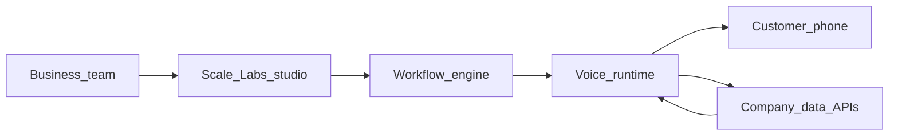

# Scale Labs — Product Description

Scale Labs is a modular platform for building autonomous voice and chat agents that handle repetitive customer communication. Businesses design conversation flows in a visual studio, connect their own data sources, assign phone numbers, and run agents around the clock—without scaling call-center headcount for every new campaign or use case. The product is built for organizations that already depend on phone and messaging to serve customers, especially in high-volume sectors such as banking, telecommunications, e-commerce, and logistics. Scale Labs is not tied to a single industry: the same workflow engine can support loan reminders, delivery updates, fraud checks, surveys, and recruitment screening, because behavior is defined by configurable flows rather than hard-coded scripts.

This document describes what Scale Labs is, who it serves, how the platform works, and which capabilities exist today versus what is planned next. The tone is intentional: this is a product brief, not a marketing slogan sheet.

---

## The problem

In Uzbekistan and in many other markets, large service businesses live on constant contact with customers. Banks send payment reminders and verify identities. Telecom operators explain balances and packages. Marketplaces and logistics companies confirm orders and deliveries. Each day brings the same categories of calls: status checks, overdue notices, appointment confirmations, simple FAQs, and security follow-ups.

To cover this, companies staff call centers—often 24 hours a day, in multiple shifts. The cost adds up quickly. A single around-the-clock seat can require three operators; at typical salary levels in Uzbekistan, that is on the order of tens of millions of UZS per month per position, and large organizations employ dozens or hundreds of such roles. That is one of the heavier operational lines in the service economy, and it grows with every new product line and every new compliance requirement.

Human teams also struggle with consistency and peaks. Operators get tired, scripts drift, and sudden spikes in volume create queues and abandoned calls. Industry experience suggests that a large share of operator time—often cited around seventy percent or more—is spent on repetitive, rule-bound conversations that do not need human judgment on every turn.

These problems are not unique to one country. Any business that scales customer communication faster than it scales support staff faces the same tension: cost, quality, and speed. Digital transformation increases the number of touchpoints; it does not automatically reduce the need for someone to answer the phone.

---

## What Scale Labs is

Scale Labs is an **autonomous communication platform** built around three ideas:

1. **Modular workflows** — Conversation logic is assembled from blocks (speak, branch, call a tool, transfer, end) instead of being frozen into a single-purpose product.
2. **Data-aware agents** — During a call, agents can look up and update records in connected systems when the workflow requires it.
3. **Operational visibility** — Calls, transcripts, and usage metrics live in a workspace dashboard so teams can monitor what agents actually did.

Voice is the primary channel in the current prototype. The architecture is intended to support chat and additional channels over time, using the same workflow definitions where possible.

Scale Labs is **not** a niche “bank bot” or “delivery bot.” It is infrastructure for many agents, each backed by a different workflow and integration set. New use cases emerge as teams publish new flows—not as the vendor ships a new SKU.

---

## How it works (buyer view)

From a customer organization’s perspective, deployment follows a straightforward pattern:

1. **Create a workspace** and configure organization access.
2. **Design a workflow** (or start from a template) in the visual editor: prompts, branches, tools, transfers, and end states.
3. **Connect data** — map databases or CRM-style sources so agents can read and write during calls.
4. **Configure voice and behavior** — language, persona, and call settings for the agent that will run the workflow.
5. **Assign telephony** — attach inbound or outbound numbers to the agent or workflow.
6. **Test** — run browser-based test calls and step through the workflow on a live canvas.
7. **Operate** — review call logs, transcripts, and metrics; iterate on flows as real conversations expose gaps.

The business team owns the **what** (scripts, rules, integrations). The platform owns the **how** (speech pipeline, orchestration, logging, scaling concurrent sessions).

---

## Core platform

The following sections describe Scale Labs in product terms. Implementation is proprietary: studio UI, orchestration API, workflow compiler, integration webhooks, and telephony session management are developed as one system.

### Workflow studio

The workflow studio is a visual graph editor. Each node type has a clear job:

| Node type | Role |
|-----------|------|
| **Start** | Entry point for the conversation. |
| **Conversation** | Spoken interaction; system prompts and optional variable extraction for later branches. |
| **Tool** | Invokes a registered integration tool (e.g. search or update a customer record). |
| **API request** | Calls an external HTTP endpoint defined in the flow. |
| **Transfer call** | Hands the caller to a human or another number when automation should stop. |
| **End call** | Closes the session cleanly. |

Flows support **branching** on natural-language conditions and structured rules. **Global nodes** can interrupt or re-enter parts of the graph when conditions match (for example, a universal “speak to a human” path). **Templates** ship for common patterns—lead qualification, appointment scheduling, customer satisfaction—so teams do not start from a blank canvas.

**Live test mode** (available in the prototype) runs a browser call against a published workflow and highlights the active step on the canvas, with a side panel for transcript and controls. That shortens the loop between editing a flow and hearing how it behaves.

### Agent layer

Alongside workflows, the platform supports **standalone agents**: configurable identity, voice, language, behavior, and optional tool access. Agents suit simpler or assistant-style use cases; complex multi-step processes are usually modeled as workflows.

Agents and workflows can be tested in the browser (voice and, for agents, text chat in the prototype). Content is synced to the voice runtime when saved so production behavior matches what was configured in the studio.

### Integration layer

Scale Labs agents become useful when they can act on real data—not only talk.

The integration model is **tool-based**: each tool exposes a schema (parameters and outcomes) that the language model can invoke mid-conversation. Webhooks execute the tool against your systems and return results to the agent.

**Today (prototype):** Notion databases are supported end-to-end—connection wizard, field mapping, and tools to save, find, search, update, and archive rows during calls. This pattern is the template for additional connectors: authenticate, map fields, register tools, handle webhooks.

**Planned:** Additional CRM and operational systems (e.g. HubSpot-style pipelines, regional CRMs), generic REST connectors, and tighter “load customer context before the call starts” automation.

The pitch to enterprises remains honest: if your data is reachable through an API and you can define safe actions, the platform is designed to wire those actions into flows—not to replace your systems of record.

### Telephony and sessions

The platform manages **phone numbers** (provision, assign to an agent or workflow, update routing). **Outbound** calling is supported at the API level for campaigns and reminders. **Inbound** handling depends on number assignment and workflow entry points.

Sessions use a real-time speech pipeline: audio to text, reasoning and tool execution, text to speech. Language support in the prototype includes English with Uzbek and Russian in active development for localized deployments.

### Operations and workspace

Operators and product owners need visibility, not only configuration.

- **Call logs** — List and detail views with transcript and metadata.
- **Metrics** — Dashboards for volume and performance, filterable by agent where applicable.
- **Multi-tenant workspaces** — Organization-scoped data and access control for teams building multiple agents.

Billing, advanced monitoring, and squad-style multi-agent handoff are **not** part of the prototype yet; they appear on the roadmap below.

---

## Modular use cases

Scale Labs is deliberately general. Below are realistic patterns the workflow system is built to support. Each can be implemented as its own flow plus integrations; none requires a separate product fork.

### Outbound reminders and collections

**What it does:** Calls customers about upcoming or overdue payments—consumer loans, university fees, utility bills, or internal AR. The agent states the amount and due date, answers allowed FAQs, and records commitment or dispute.

**What it needs:** Customer identifier, balance, due date, and policy rules (what the bot may promise vs. escalate). Writeback to a ledger or CRM when the customer agrees to pay or requests a callback.

### Inbound support and FAQ

**What it does:** Answers high-volume questions—balance, order status, branch hours, eligibility—without queueing for a human unless the flow requires it.

**What it needs:** Read access to account or order APIs; clear escalation paths for edge cases; updated knowledge in prompts or tool results.

### Lead qualification and surveys

**What it does:** Asks a structured set of questions, scores or tags the lead, and routes hot leads to sales or schedules a follow-up. Customer satisfaction (CSAT) surveys fit the same pattern with different questions and scoring.

**What it needs:** CRM or spreadsheet/database write access; branch conditions (e.g. budget, timeline, product interest); optional transfer to a human closer.

### Appointment scheduling and confirmations

**What it does:** Offers slots, confirms bookings, sends verbal confirmation, and reschedules or cancels when the customer requests it.

**What it needs:** Calendar or booking API; business rules for availability; reminders as outbound calls or messages in a later channel phase.

### Fraud and step-up verification

**What it does:** When a risk event occurs (login from a new device, large transfer, password reset), the agent calls the customer, asks verification questions (device model, location, intent), and logs the outcome—pass, fail, or escalate to fraud ops.

**What it needs:** Event trigger from security or core banking; scripted question sets; immutable logging; tight transfer to a fraud queue when answers fail policy.

### Logistics and delivery

**What it does:** Notifies customers of courier ETA, failed delivery, or pickup readiness; captures preferred redelivery windows.

**What it needs:** Shipment status from WMS or marketplace APIs; geographies and languages per region; handoff to human support for damaged or lost goods.

### HR and recruitment screening

**What it does:** First-pass phone screens—availability, role fit, salary band, location—before scheduling interviews with recruiters.

**What it needs:** Job metadata; calendar for booking; storage of candidate responses; compliance with local labor and recording rules.

### Utilities and telecommunications

**What it does:** Outage notifications, plan changes, SIM or line activation status, and prepaid balance explanations—high repeat volume, script-friendly.

**What it needs:** Subscriber systems; product catalog; outage feed; regulatory disclaimers in prompts.

### Healthcare and public-service reminders (where permitted)

**What it does:** Appointment reminders, vaccination or check-up recalls, and document-deadline nudges—with strict scope limits on medical advice.

**What it needs:** Scheduling integration; consent and opt-out handling; jurisdiction-specific compliance review before production.

### E-commerce and marketplaces

**What it does:** Order confirmation, refund status, return instructions, and seller/buyer dispute triage for platforms with large call volume.

**What it needs:** Order and user APIs; marketplace policies encoded in branches; escalation to human dispute teams.

New use cases will appear as customers connect new APIs and publish new workflows. That is the point of modular design: the platform does not need a release cycle per industry vertical.

---

## Who it is for

Scale Labs fits organizations that:

- Already spend heavily on call centers or BPO for repetitive conversations.
- Have (or can build) API access to customer and transaction data.
- Need 24/7 or burst capacity without hiring proportional staff.
- Want to experiment with many conversation products on one stack.

**Primary sectors in our market context:** banks and microfinance, telecommunications, e-commerce and marketplaces, logistics and last-mile delivery, edtech and training providers with enrollment calls, and any fintech or collections operation with outbound reminder volume.

**Buyers and champions:** Head of customer service, operations directors, digital transformation leads, and founders of growth-stage companies that cannot yet afford a full three-shift call floor.

---

## Why modular workflows matter

Traditional IVR and static scripts are expensive to change: every new product line or regulation can require a vendor ticket and weeks of retesting. Scale Labs treats conversation logic as **versioned configuration**:

- One platform trains operations and engineering on a single studio.
- Many “agents” are really **published workflows** plus voice settings and integrations.
- Branching and tool calls are explicit on the canvas, which helps compliance and QA review flows before go-live.
- Templates accelerate common verticals; custom flows handle differentiation.

For a diploma project and an early startup, this also means **learning compounds**: improvements to the editor, compiler, and runtime benefit every customer use case, not one niche demo.

---

## Current stage (prototype)

Scale Labs is in **prototype** stage: core paths work end-to-end, but not every channel and integration from the long-term vision is shipped.

**Working today:**

- Autonomous agent configuration and sync to the voice runtime.
- Visual workflow editor with compile-and-publish pipeline.
- Workflow templates (lead qualification, appointment scheduler, customer satisfaction).
- Browser-based voice testing for agents and workflows, including live workflow step highlighting during test calls.
- Notion integration: database connection, field mapping, and callable tools during conversations.
- Phone number management and assignment to agents or workflows.
- Call logs and metrics dashboard (organization-scoped).
- English voice demonstrations end-to-end; Uzbek localization in progress (speech and phrasing).
- Multi-organization workspace with authentication.

**Not yet available (honest gaps):**

- Billing and subscription enforcement in the product UI.
- HubSpot, Bitrix24, and other CRM connectors beyond Notion.
- Squads (multi-agent orchestration) and dedicated live monitoring consoles.
- First-class email and SMS modules as peers to voice (some capabilities exist only as design targets).
- Fully automatic “preload customer context on ring” for standalone agents without workflow tool steps.
- Generic “connect any API in two clicks” marketplace—pattern exists via API request nodes and custom tools, but not a full connector catalog.

We describe these gaps openly so evaluations—academic or commercial—match what the software actually does.

---

## Roadmap (next 6–12 months)

Phasing follows product maturity, not feature inflation.

| Phase | Focus |
|-------|--------|
| **Prototype (now)** | Prove reliable autonomous voice, workflow publishing, one deep integration (Notion), and operator visibility. |
| **MVP** | Stable English and Uzbek voice; expanded third-party connectors; pilot users on real numbers; feedback-driven UX. |
| **Product** | Billing, stronger onboarding, more templates, performance tuning for concurrent calls, compliance hooks. |
| **Scale** | Partnerships, analytics for ROI, enterprise deployment options, connector ecosystem growth. |

Specific milestones aligned with current planning:

- Complete Uzbek voice quality for local deployments.
- Ship two to three additional integrations used by pilot customers (CRM or internal API adapters).
- Workflow and agent storage fully server-authoritative (reducing reliance on browser-only drafts).
- Outbound campaign tooling in the UI (API exists; product surfacing is thin).
- Pre-call context injection and richer tool library for standalone agents.

Roadmap items will shift based on pilot feedback; the modular architecture is meant to absorb that change without rewrites.

---

## Team

**Scale Labs** is the product. **Team 10x** is the development team behind it (the project began under the name 10x and rebranded to Scale Labs while retaining the team identity for legal and hackathon context).

Today the core build is led by a solo founder with full-stack ownership: agent systems, backend (Python/Django), frontend (Next.js/React), API design, and product UI. That keeps iteration fast at prototype stage; hiring for integrations, voice tuning, and sales is planned as pilots convert to paying deployments.

---

## Design influences

The workflow studio and test experience were informed by studying how established **voice-AI workflow products** in the market handle graph editing, branching, and live debugging. Scale Labs’s data model, compiler, integration webhooks, and studio UI are **original implementations** built for this codebase and deployment model—not a white-label of another product. We acknowledge industry precedent where it helps users orient; we do not claim novelty for the idea of visual voice bots themselves.

---

## Closing

Scale Labs exists to turn repetitive customer communication into **configurable, measurable software**. Markets like Uzbekistan feel the cost of call centers acutely, but the underlying need is global: speak to customers at scale, with consistent quality, connected to real business data.

The platform is early, but the direction is deliberate—modular workflows, proprietary orchestration, and integrations that deepen over time. For organizations drowning in reminder calls, status checks, and survey dialers, that is a practical path to lower cost per contact and faster iteration than hiring another shift. For the team building it, that is also a credible foundation for a real product business when capacity returns after prototype and diploma delivery.

---

## Appendix: Presentation vs implementation

Use this table when presenting or defending the project against technical questions.

| Topic | Described in this document | Prototype status |
|-------|------------------------------|------------------|
| Visual workflow editor | Core platform | **Shipped** |
| Voice calls (in/out) | Telephony & sessions | **Shipped** (outbound API; UI varies) |
| Browser test + live workflow canvas | Workflow studio | **Shipped** |
| Notion read/write in calls | Integration layer | **Shipped** |
| Generic any-CRM connector | Integration layer | **Pattern only**; Notion live, others planned |
| Email / SMS modules | Modular blocks | **Planned**; not first-class in prototype |
| Billing / plans | Operations | **Planned**; placeholder UI |
| Squads / multi-agent teams | Operations | **Planned** |
| Live monitoring console | Operations | **Planned** |
| Uzbek voice | Sessions | **In progress** |
| English voice | Sessions | **Shipped** |
| Multi-tenant org workspace | How it works | **Shipped** |

---

*For slide-style pitch content and hackathon narrative, see also [pitch-decription.md](pitch-decription.md). This file is the extended product description.*
